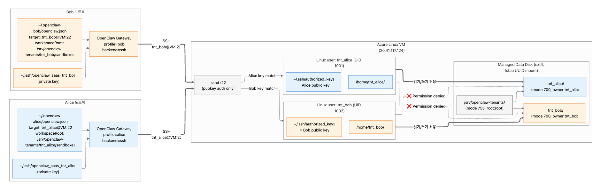
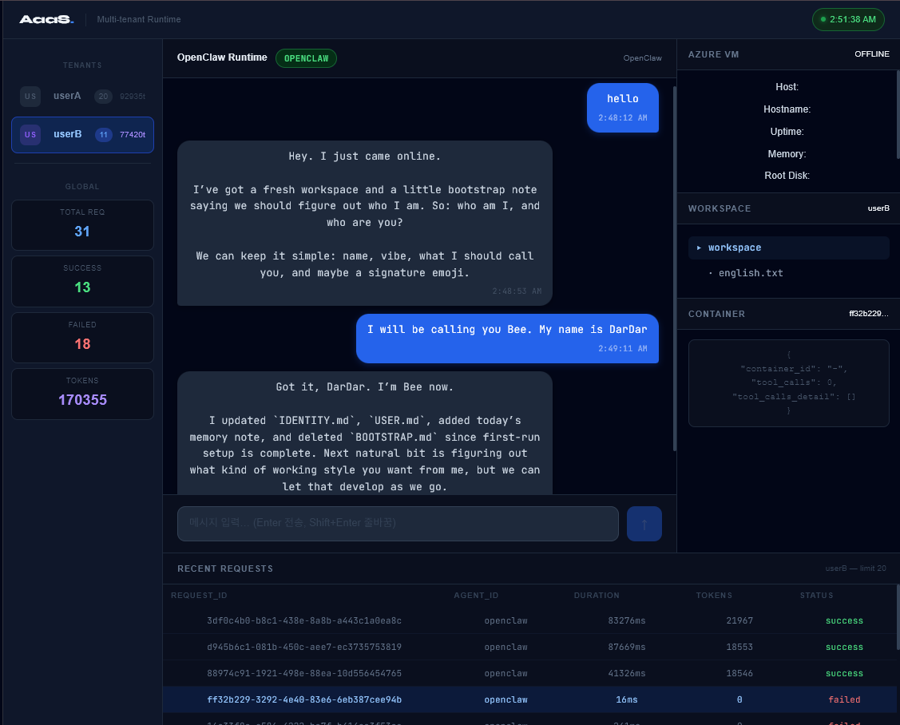

# OpenClaw 기반 멀티테넌트 Agent-as-a-Service(AaaS) 플랫폼 구축

## A. 프로젝트 명

사용자별 Workspace와 OAuth 인증을 지원하는 OpenClaw 기반 Multi-Tenant Agent-as-a-Service (AaaS) 플랫폼

## B. 프로젝트 멤버 이름 및 담당 파트 소개


| 이름       | 담당 파트                        | 주요 업무                                                                                     |
| -------- | ---------------------------- | ----------------------------------------------------------------------------------------- |
| 김성욱 (팀장) | OpenClaw 연동 및 발표             | 개발 가이드 및 핸드아웃 작성, 시스템 통합 검증 및 테스트, OpenClaw 페어링 문제 분석, openclaw-proxy 개발                  |
| 따다소      | 멀티테넌트 웹 UI 개발 및 보고서 작성       | 사용자 전환 대시보드, Workspace 패널, 실시간 사용량 시각화, 보고서 및 발표 자료 작성                                    |
| 이시하      | 전체적인 클라우드 인프라 구축 및 테넌트 프로비저닝 | Azure VM 구성, 테넌트별 Linux 계정·Workspace 격리, SSH 키 발급, OpenClaw SSH Sandbox 연동, gateway 인증 설정 |


## C. 프로젝트 소개

OpenClaw를 기반으로 여러 사용자가 하나의 클라우드 Sandbox 실행 환경을 공유하면서도 독립적인 작업 공간을 유지할 수 있는 Multi-Tenant Agent-as-a-Service(AaaS) 플랫폼을 구현하는 것을 목표로 한다.

기존 OpenClaw는 Local-First 구조로 설계되어 Agent 실행 환경과 Workspace가 사용자 개인 PC에 종속된다. OpenClaw 기준 최소 권장 메모리는 약 4GB 수준이지만, 여러 Agent 작업을 동시에 수행하거나 고부하로 운용하는 경우 16GB 이상의 메모리가 요구될 수 있어 사용자 PC 사양에 따라 실행 품질이 크게 달라진다. 또한 단일 머신을 여러 사용자가 공유하는 방식으로는 Workspace 충돌, 사용자 간 격리 불가, 협업 환경 구성의 어려움이 발생한다.

이를 해결하기 위해 Azure VM 상에 공용 Sandbox 실행 환경을 구축하고, 각 사용자에게 독립적인 Linux 계정과 Workspace를 제공하는 구조를 설계했다. OpenClaw Core는 수정하지 않고 기존 SSH Sandbox Backend를 활용하여 Agent의 Tool 실행과 Workspace 작업을 클라우드로 오프로드하는 방식을 검증했다.

## D. 프로젝트 필요성 소개

최근 LLM 기반 개발 도구는 단순한 질의응답형 챗봇을 넘어, 파일을 읽고 수정하며 명령을 실행하는 Agent Harness 형태로 발전하고 있다. OpenClaw, Hermes, Claude Code와 같은 도구는 이러한 흐름을 보여주는 대표적인 사례이며, 개발자는 Agent를 통해 코드 작성, 테스트, 문서화, 운영 자동화 작업을 하나의 흐름으로 수행할 수 있다.

그러나 현재의 Agent Harness는 대부분 Local-First 구조를 전제로 한다. 사용자는 개인 PC에 실행 환경, 의존성, Workspace, 인증 정보를 직접 구성해야 하며, Agent의 Tool 실행도 로컬 자원에 의존한다. 이 방식은 개인 개발자에게는 유연하지만, 복잡한 설정과 운용 부담 때문에 사용 진입장벽이 높고, 실무 도입 이전 단계에서 이미 환경 구성과 자원 요구사항이라는 장벽에 부딪히기 쉽다. 여러 사용자가 동일한 실행 환경을 공유하거나 조직 단위로 Agent를 운영하려는 경우에는 다음과 같은 한계가 발생한다.

- 사용자 PC의 CPU, 메모리, 디스크 성능에 따라 Agent 실행 품질이 달라진다.
- OpenClaw와 같은 Agent Harness는 기본 실행에도 일정 수준 이상의 메모리를 요구하며, 고부하 운용 시 일반 사용자 PC에서 안정적으로 실행하기 어렵다.
- 사용자마다 개발 도구와 의존성 버전이 달라 재현성이 떨어진다.
- 여러 사용자가 같은 Agent 환경을 사용할 때 Workspace 충돌과 데이터 노출 위험이 생긴다.
- 단일 머신을 팀원이 공유하는 방식으로는 사용자별 페르소나, Workspace, 권한을 안정적으로 분리하기 어렵다.
- 사용자별 실행 이력, 파일 변경 이력, 요청 로그를 중앙에서 관리하기 어렵다.
- 기업 또는 교육 환경에서 사용자별 권한과 작업 공간을 일관되게 통제하기 어렵다.

특히 OpenClaw와 Hermes처럼 Tool 실행, 파일 접근, 서브에이전트 실행을 지원하는 Agent Harness는 단순한 웹 챗봇보다 더 많은 컴퓨팅 자원과 격리 정책을 필요로 한다. 여러 Agent 작업을 동시에 수행하거나 장시간 실행되는 작업을 처리할 경우, 일반 사용자 PC에서 안정적으로 운영하기 어렵고 보안 경계도 불명확해진다.

따라서 Agent Harness를 클라우드 서비스 형태로 전환하려면 다음 요구사항이 필요하다.

- 테넌트 격리: 사용자별 독립적인 Workspace 제공 및 데이터 분리
- 인증/인가: 사용자 신원 확인과 권한 기반 접근 제어
- 감사 추적: 요청 이력, Tool 실행 결과, 파일 변경 내역 기록
- 실행 환경 표준화: 공통 클라우드 런타임을 통한 재현성 확보
- 운영 관리: 서비스 상태, 사용량, 장애 상황을 확인할 수 있는 관리 인터페이스

본 프로젝트는 이러한 문제를 해결하기 위해 OpenClaw 기반 Agent 실행 구조를 클라우드 환경으로 확장하고, 멀티테넌트 Workspace와 Gateway 패턴을 결합한 AaaS 플랫폼을 설계 및 구현했다. 특히 OpenClaw Core를 직접 수정하지 않고 기존 SSH Sandbox Backend를 활용하여, Local Gateway를 유지하면서도 Agent의 Tool 실행과 Workspace 작업을 Azure VM으로 오프로드할 수 있음을 검증했다는 점에 의의가 있다.

## E. 관련 기술/논문/특허 조사 내용 소개

### 1. Agent-as-a-Service(AaaS)

AaaS는 AI Agent를 클라우드 서비스 형태로 제공하는 구조로, 사용자가 실행 환경을 직접 구축하지 않고 API 또는 웹 인터페이스를 통해 에이전트 기능을 활용하는 방식이다. Yao et al.(2023)의 ReAct 프레임워크는 LLM이 추론과 행동을 반복하는 Agentic Loop 구조를 제안했으며, 이는 AaaS의 핵심 실행 패러다임으로 널리 활용된다. Significant GRAVITAS의 AutoGPT(2023)와 같은 오픈소스 구현체는 AaaS 개념의 실용적 적용 사례로 참조된다.

[1]
ReAct: Synergizing Reasoning and Acting in Language Models
Yao, S. et al. — ICLR 2023 · arXiv:2210.03629
[2]
Toolformer: Language Models Can Teach Themselves to Use Tools
Schick, T. et al. — NeurIPS 2023 · arXiv:2302.04761
[3]
AutoGPT: An Autonomous GPT-4 Experiment
Significant Gravitas — GitHub, 2023 · github.com/Significant-Gravitas/AutoGPT

### 2. Multi-Tenant Architecture

멀티테넌트 아키텍처는 하나의 소프트웨어 인스턴스가 다수의 독립 사용자(테넌트)에게 서비스를 제공하는 설계 방식이다. 본 프로젝트는 사용자별 Workspace를 논리적으로 분리하는 방식을 채택하여 구현 복잡도를 낮추면서도 테넌트 간 데이터 격리를 달성했다. Microsoft Azure Architecture Center(2023)는 멀티테넌트 SaaS 구축의 주요 설계 원칙으로 테넌트 온보딩 자동화, 자원 공유 전략, 격리 수준 결정 프레임워크를 제시하고 있어 본 프로젝트의 아키텍처 설계 과정에서 참고했다.

[4]
Multi-Tenant SaaS Applications: Current Status and Research Opportunities
Bezemer, C. & Zaidman, A. — EVOL '10, ACM, 2010
[5]
Patterns for Multi-Tenancy in SaaS Applications
Microsoft Azure Architecture Center — learn.microsoft.com, 2023

### 3. OpenClaw

OpenClaw는 AI Agent 실행을 지원하는 오픈소스 플랫폼이다. 본 프로젝트에서는 OpenClaw Core를 직접 수정하지 않고, 기존 SSH Sandbox Backend를 활용하여 로컬 Gateway에서 발생한 Agent Tool 실행을 Azure VM의 사용자별 Workspace로 전달하는 구조를 검증했다. 또한 웹 Dashboard와 AaaS Gateway에서는 OpenClaw 연동 경로를 함께 제공하여 백엔드 연동 확장 가능성을 확인했다.

### 4. API Gateway 및 인증/인가 패턴

API Gateway 패턴은 마이크로서비스 환경에서 인증, 라우팅, 로깅, 속도 제한 등의 공통 관심사를 단일 진입점에서 처리하는 구조이다. Richardson(2018)은 Gateway를 클라이언트-서버 간 요청 집약 및 변환 계층으로 정의하며, 이는 본 프로젝트의 AaaS Gateway 설계와 일치한다. 인증 방식으로는 IETF RFC 6749(OAuth 2.0)와 RFC 7519(JWT)가 사실상 표준(de facto standard)으로 통용되며, 본 프로젝트의 사용자 인증 및 세션 관리 구현에 적용했다.

[6] 
Richardson, C., Microservices Patterns, Manning, 2018 (Ch. 8)API Gateway 
[7] 
Hardt, D. (Ed.), The OAuth 2.0 Authorization Framework, RFC 6749, IETF, 2012
[8] 
Jones, M. et al., JSON Web Token (JWT), RFC 7519, IETF, 2015

## F. 프로젝트 개발 결과물 소개

### 시스템 구조도



### 시스템 개요

본 프로젝트는 OpenClaw를 기반으로 다수의 사용자가 하나의 클라우드 Sandbox 실행 환경을 공유하면서도 독립적인 작업 공간을 유지할 수 있는 Multi-Tenant Agent-as-a-Service(AaaS) 플랫폼을 구현하는 것을 목표로 한다.

기존 OpenClaw는 Local-First 구조로 설계되어 Agent 실행 환경과 Workspace가 사용자 개인 PC에 종속된다. 이 경우 여러 사용자가 동일한 Agent 환경을 공유하기 어렵고, 파일 충돌, 환경 불일치, 사용자 간 데이터 노출 등의 문제가 발생할 수 있다.

본 프로젝트는 OpenClaw Core를 수정하지 않고 기존 SSH Sandbox Backend를 활용하여 Azure VM 상에 공용 Sandbox 실행 환경을 구축했다. 각 사용자는 독립적인 Linux 계정과 Workspace를 부여받으며, OS 권한을 이용하여 사용자 간 격리를 보장한다. 최종 핵심 실행 경로에서는 각 사용자가 자신의 로컬 OpenClaw Gateway를 실행하고, Agent의 Shell/File Tool 실행은 SSH 기반 연결을 통해 Azure VM의 Tenant Workspace에서 수행된다. AaaS Gateway와 웹 Dashboard는 인증, 인가, 요청 라우팅, 로그 관리, 사용량 관찰을 확인하기 위한 웹 기반 보조 시연 경로로 구현했다.

### 주요 기능

#### 1. Multi-Tenant Workspace 관리

본 시스템은 멀티테넌트 구조를 기반으로 설계되었다.

각 사용자는 Azure VM 내부에서 독립적인 Linux 계정을 부여받는다.

```text
tnt_alice
tnt_bob
tnt_charlie
```

각 사용자에게는 전용 Workspace가 생성된다.

```text
/srv/openclaw-tenants/tnt_alice/
/srv/openclaw-tenants/tnt_bob/
/srv/openclaw-tenants/tnt_charlie/
```

Workspace는 Linux 파일 권한(chmod 700)과 Gateway/OpenClaw 경로 검증을 통해 보호된다. 최종 사용자 요청 경로에서는 다른 사용자의 Workspace가 조회 가능한 디렉터리로 노출되지 않으며, 타 테넌트 구조 조회 시 `No such file or directory`로 처리된다.

이를 통해 다음을 보장한다.

- 사용자 데이터 격리
- 파일 충돌 방지
- 독립적인 Agent 작업 환경 제공
- 보안성 향상

#### 2. AaaS Gateway

Gateway는 웹 Dashboard 기반 시연에서 AI 요청의 진입점 역할을 수행한다. 최종 핵심 실행 경로는 로컬 OpenClaw Gateway와 SSH Sandbox Backend이지만, AaaS Gateway를 통해 조직 관리자가 요청 흐름과 테넌트별 사용량을 관찰할 수 있는 별도 관리 경로를 함께 검증했다.

주요 기능은 다음과 같다.

- 사용자의 신원 검증 (Authentication)
- 사용자의 접근 권한 확인 (Authorization)
- 요청 라우팅
- 요청 이력, Tool 실행 결과, 파일 변경 내역 기록

#### 3. 조직 관리형 AI Agent 선택 구조
조직(VM 운영자)이 업무에 최적화된 AI 모델을 선정하고, 해당 모델의 API 키를 테넌트에게 발급하는 구조를 채택했다. 테넌트는 조직으로부터 할당받은 키를 사용하여 OpenClaw Agent를 통해 클라우드 Workspace에서 작업을 수행한다.

이 구조를 통해 다음을 실현할 수 있다.

- 조직이 사용 모델과 비용을 중앙에서 관리
- 테넌트별 독립적인 AI 페르소나 운영
- 키 발급 및 회수를 통한 접근 권한 제어
- 향후 다양한 AI Backend(상용 LLM, 오픈소스 모델 등)로의 확장 가능성 확보

#### 4. SSH 기반 클라우드 Sandbox

본 프로젝트는 OpenClaw의 기존 SSH Backend를 활용하여 Agent의 Tool 실행과 Workspace 파일 작업이 Azure VM에서 수행되도록 구성했다. 사용자는 자신의 PC에서 OpenClaw Gateway를 실행하지만, Sandbox로 라우팅된 명령과 파일 작업은 Azure VM 내부의 Tenant Workspace에서 수행된다.

이를 통해 다음과 같은 효과를 얻을 수 있다.

- 사용자 PC 부하 감소
- 공통 실행 환경 제공
- 환경 재현성 확보
- 조직 단위 Agent 운영 가능

또한 새로운 사용자는 SSH Key 발급과 Workspace 생성만으로 별도 VM 재시작 없이 즉시 서비스를 이용할 수 있다.

#### 5. Dashboard 기반 요청 관리

Dashboard에서는 등록된 테넌트(userA, userB 등)의 사용 현황을 시각적으로 확인할 수 있으며, 각 사용자의 요청 수(Requests), 성공 횟수(Success), 실패 횟수(Failed), 평균 응답 시간(Average Duration) 등의 정보를 실시간으로 제공한다. 또한 테넌트별 누적 토큰 사용량을 집계하여 사이드바에 실시간으로 표시함으로써, 운영자가 각 테넌트의 AI 모델 사용량을 한눈에 파악할 수 있도록 구현했다.

- 각 사용자의 서비스 이용 현황을 실시간으로 집계 후 시각화
- 요청 성공 및 실패 수를 구분하여 표시
- Tenant 간 사용량 차이 및 시스템 부하 상태 확인
- 별도 새로고침 없이 3초마다 최신 정보 자동 반영

현재 Dashboard는 프로젝트 시연을 목적으로 개발되었으며 요청 통계, 사용자 정보, Gateway 상태 정보 등을 하나의 화면에서 통합 제공하는 형태로 구현되어 있다. 따라서 일부 기능은 독립적인 모듈로 완전히 분리되지 않고 하나의 대시보드 내부에 통합되어 있으며, 향후 서비스 고도화 과정에서 기능별 화면 분리 및 세분화가 가능하도록 설계했다.

### 6. 검증 결과

본 프로젝트에서는 구현 결과가 목표한 멀티테넌트 AaaS 구조로 동작하는지 확인하기 위해 Alice와 Bob 두 사용자를 기준으로 테스트를 수행했다.

주요 검증 결과는 다음과 같다.

- Azure VM에 `tnt_alice`, `tnt_bob` 사용자 계정과 Tenant별 Workspace가 생성됨을 확인했다.
- Alice의 SSH Key는 Alice 계정에만 접속할 수 있고, Bob의 SSH Key는 Bob 계정에만 접속할 수 있음을 확인했다.
- Alice 계정에서 Bob Workspace에 접근하거나 Bob 계정에서 Alice Workspace에 접근할 경우 `No such file or directory`가 발생하도록 처리되어, 다른 테넌트의 Workspace 구조 자체를 조회할 수 없음을 확인했다.
- OpenClaw SSH Sandbox Backend를 통해 Azure VM의 Tenant별 Workspace에서 파일 생성과 명령 실행이 가능함을 확인했다.
- OpenAI OAuth 기반 Agent 실행에서도 `sandbox_exec` 경로를 사용할 경우 결과 파일이 Azure VM의 Tenant Workspace에 생성됨을 확인했다.

이를 통해 본 프로젝트의 핵심 목표였던 “여러 사용자가 각자의 Local Gateway를 사용하면서도 클라우드의 공용 Sandbox Host를 통해 독립적인 Workspace에서 Agent 작업을 수행하는 구조”가 PoC 수준에서 가능함을 검증했다.

### 7. 중간 보고서 대비 최종 결과물 변경 사항
중간 보고서 시점과 최종 결과물 사이에는 두 가지 주요 변경이 있었다.
1) OpenClaw 연동 방식 변경
중간 보고서 시점에는 OpenClaw SSH Sandbox Backend와의 연동에 어려움이 있어, Gateway의 백엔드 선택지로 Mock LLM, OpenAI API, OpenClaw Agent 세 가지를 병렬로 두는 구조를 설계했다. OpenClaw 연동이 불안정한 상황에서도 시스템 전체 동작을 검증하기 위한 대안적 접근이었다.
이후 OpenClaw SSH Sandbox Backend 연동 문제를 해결하여 최종 결과물에서는 OpenClaw Agent가 정식 실행 경로로 동작하게 되었다.
2) 실시간 모니터링 Dashboard 추가
중간 보고서 시점에는 모니터링 기능이 포함되지 않았으나 이후 테넌트별 요청 수, 성공/실패 횟수, 평균 응답 시간을 실시간으로 시각화하는 Dashboard가 추가되었다. 이를 통해 운영자가 시스템 상태와 각 테넌트의 사용 현황을 한눈에 파악할 수 있게 되었다. 또한 중간 보고서까지는 Docker Compose로 Gateway를 띄우고 웹 UI에서 백엔드를 선택하는 구조였으나, 최종 결과물에서는 Docker 없이 각 테넌트가 로컬에서 OpenClaw Gateway를 직접 실행하고 SSH를 통해 Azure VM의 독립 Workspace에 접속하는 구조로 목적과 아키텍처가 전환되었다.

### 8. 향후 발전 방향

본 프로젝트는 멀티테넌트 환경에서 AI Agent를 서비스 형태로 제공하기 위한 핵심 기능을 구현하는 데 중점을 두었다. 향후에는 다음과 같은 기능을 추가하여 보다 완성도 높은 AaaS(Agent as a Service) 플랫폼으로 발전시킬 수 있다.

- 클라우드 서비스 고도화: 현재는 단일 환경에서 동작하는 데모 수준의 구조이지만, 향후 Auto Scaling과 고가용성(HA) 구성을 적용하여 대규모 사용자가 동시에 접속하더라도 안정적으로 서비스를 제공할 수 있도록 확장할 수 있다. 또한 Workspace 자동 백업 및 복구 기능을 추가하여 데이터 안정성을 향상시킬 수 있다.
- 보안 체계 강화: Tenant 간 격리를 더욱 강화하기 위해 SSH Certificate Authority(CA) 기반 인증 체계를 도입하고, Agent 설정 정보 및 Skill 정보를 보호하는 보안 정책을 적용할 수 있다. 또한 LLM 사용 과정에서 발생할 수 있는 데이터 유출 문제를 방지하기 위한 보안 설계도 추가적으로 필요하다.
- 사용량 분석 및 비용 관리: 현재 구현된 사용량 모니터링 기능을 발전시켜 Tenant별 요청 수, 응답 시간, 자원 사용량 등을 세밀하게 분석할 수 있다. 이를 기반으로 사용량 기반 과금(Billing) 체계를 구축한다면 실제 서비스 형태의 운영도 가능할 것으로 기대된다.
- Dashboard 기능 확장: 현재 Dashboard는 시연 목적의 통합 모니터링 화면으로 구현되어 있다. 향후에는 요청 관리, 사용자 관리, Agent 관리, 시스템 모니터링 기능을 각각 독립적인 메뉴로 분리하고, 실시간 로그 조회 및 시스템 상태 분석 기능을 추가하여 운영 편의성을 높일 수 있다.
- 다양한 AI Backend 지원: 현재 연동된 AI Backend 외에도 다양한 상용 및 오픈소스 LLM을 지원하여 사용자가 목적에 따라 적절한 모델을 선택할 수 있도록 확장할 수 있다. 이를 통해 플랫폼의 활용 범위를 더욱 넓힐 수 있을 것으로 기대된다.

이를 통해 본 프로젝트는 단순한 AI Agent 실행 환경을 넘어, 기업 및 연구기관에서도 활용 가능한 클라우드 기반 AI Agent 운영 플랫폼으로 발전할 수 있을 것으로 기대한다.

## G. 개발 결과물을 사용하는 방법 소개

본 프로젝트의 최종 시연은 각 사용자가 자신의 PC에서 OpenClaw Gateway를 실행하고, 실제 Shell/File Tool 실행은 Azure VM의 사용자별 SSH Sandbox Workspace에서 수행되는 방식으로 진행했다. 웹 Dashboard와 AaaS Gateway는 요청 흐름과 사용량을 관찰하기 위한 보조 시연 경로이며, 핵심 검증은 `backend: "ssh"`를 사용하는 OpenClaw Sandbox 연동이다.

### 1. 시연 환경 개요

시연에 사용한 Azure VM은 `20.41.117.124`이며, VM 운영자 계정은 `azureuser`이다. Tenant는 Alice와 Bob 두 명으로 구성했다.

```text
Azure VM: 20.41.117.124
운영자 계정: azureuser
Tenant 계정:
  - tnt_alice
  - tnt_bob
Workspace root:
  - /srv/openclaw-tenants/tnt_alice/sandboxes
  - /srv/openclaw-tenants/tnt_bob/sandboxes
```

각 Tenant는 서로 다른 Linux 계정과 SSH Key를 사용한다. `tnt_alice`는 Alice Workspace만 접근할 수 있고, `tnt_bob`는 Bob Workspace만 접근할 수 있다. 격리는 OpenClaw 설정만이 아니라 Azure VM의 Linux 파일 권한(`chmod 700`)과 사용자별 경로 검증으로 강제되며, 최종 사용자 요청 경로에서는 타 테넌트 Workspace가 존재하지 않는 경로처럼 처리된다.

### 2. Azure VM 및 Workspace 준비

먼저 운영자가 Azure VM에 접속한다.

```bash
ssh -i "C:\Users\siha\Downloads\vm1_key.pem" azureuser@20.41.117.124
```

VM에 연결된 데이터 디스크를 `/srv/openclaw-tenants`에 마운트하고, 재부팅 후에도 유지되도록 `/etc/fstab`에 등록한다.

```bash
lsblk
sudo parted /dev/sda --script mklabel gpt mkpart primary ext4 0% 100%
sudo mkfs.ext4 -F /dev/sda1
sudo mkdir -p /srv/openclaw-tenants
sudo mount /dev/sda1 /srv/openclaw-tenants

UUID=$(sudo blkid -s UUID -o value /dev/sda1)
echo "UUID=$UUID  /srv/openclaw-tenants  ext4  defaults,nofail  0  2" | sudo tee -a /etc/fstab
sudo mount -a
sudo chmod 755 /srv/openclaw-tenants
sudo chown root:root /srv/openclaw-tenants
```

이후 Agent 실행에 필요한 기본 도구를 설치한다.

```bash
sudo apt update
sudo apt -y upgrade
sudo apt -y install bash python3 python3-pip python3-venv git curl jq ripgrep openssh-server ca-certificates build-essential
```

### 3. Tenant 프로비저닝

운영자 PC에서 프로비저닝 입력 파일인 `tenants.json`과 Tenant 생성 스크립트인 `provision-tenants.sh`를 VM으로 전송한다. 두 파일은 Azure VM에 생성할 Tenant 목록과 Linux 계정/Workspace/SSH Key 생성 절차를 담은 운영자용 파일이다.

```powershell
scp -i "C:\Users\siha\Downloads\vm1_key.pem" tenants.json azureuser@20.41.117.124:~/tenants.json
scp -i "C:\Users\siha\Downloads\vm1_key.pem" .\scripts\provision-tenants.sh azureuser@20.41.117.124:~/provision-tenants.sh
```

VM에서 프로비저닝 스크립트를 실행하면 `tnt_alice`, `tnt_bob` Linux 계정, Tenant별 Workspace, Tenant별 SSH Key가 생성된다.

```bash
mkdir -p ./openclaw-aaas
mv ./tenants.json ./openclaw-aaas/
mv ./provision-tenants.sh ./openclaw-aaas/
cd ./openclaw-aaas
sudo VM_HOST=20.41.117.124 ./provision-tenants.sh

id tnt_alice
id tnt_bob
ls -ld /srv/openclaw-tenants/tnt_alice
ls -ld /srv/openclaw-tenants/tnt_bob
ls -la ~/openclaw-aaas/keys/
```

Tenant 격리는 다음 방식으로 확인한다. 최종 요청 경로에서는 사용자 Workspace root가 자기 Tenant 하위로 고정되므로, Alice 컨텍스트에서 Bob 경로를 조회하면 `No such file or directory`가 발생해야 정상이다. 또한 Alice SSH Key로 Bob 계정에 접속하는 것도 실패해야 한다.

```bash
# Alice 요청 컨텍스트에서 Bob 경로 조회 시도
sudo -u tnt_alice bash -lc 'ls /srv/openclaw-tenants/tnt_alice/sandboxes/../tnt_bob'
# expected: No such file or directory

# Alice SSH Key로 Alice 계정 접속은 성공해야 함
cp ~/openclaw-aaas/keys/openclaw_aaas_tnt_alice /tmp/test_alice
chmod 600 /tmp/test_alice
ssh -i /tmp/test_alice -o StrictHostKeyChecking=no tnt_alice@localhost 'whoami; pwd'

# Alice SSH Key로 Bob 계정 접속은 실패해야 함
ssh -i /tmp/test_alice -o StrictHostKeyChecking=no tnt_bob@localhost 'whoami' 2>&1 | head -5
rm /tmp/test_alice
```

### 4. 사용자 PC에 SSH Key와 OpenClaw 설정 배포

운영자는 VM에서 생성된 Tenant Key와 OpenClaw 설정 snippet을 로컬 PC로 회수한다.

```powershell
cd C:\cloud\repo
scp -i "C:\Users\siha\Downloads\vm1_key.pem" -r azureuser@20.41.117.124:~/openclaw-aaas/keys/ .\keys-from-vm\
scp -i "C:\Users\siha\Downloads\vm1_key.pem" -r azureuser@20.41.117.124:~/openclaw-aaas/generated/ .\generated-from-vm\

scp -i "C:\Users\siha\Downloads\vm1_key.pem" -r azureuser@20.41.117.124:~/openclaw-aaas/keys/openclaw_aaas_tnt_alice .\keys\
scp -i "C:\Users\siha\Downloads\vm1_key.pem" -r azureuser@20.41.117.124:~/openclaw-aaas/keys/openclaw_aaas_tnt_bob .\keys\
scp -i "C:\Users\siha\Downloads\vm1_key.pem" -r azureuser@20.41.117.124:~/openclaw-aaas/generated/openclaw-config-tnt_alice.json5 .\generated\
scp -i "C:\Users\siha\Downloads\vm1_key.pem" -r azureuser@20.41.117.124:~/openclaw-aaas/generated/openclaw-config-tnt_bob.json5 .\generated\
```

사용자 PC에서는 자신에게 배정된 Private Key를 `~/.ssh`에 설치하고 권한을 제한한다. Windows 기준 예시는 다음과 같다.

```powershell
New-Item -ItemType Directory -Path $env:USERPROFILE\.ssh -Force | Out-Null
Copy-Item C:\cloud\repo\keys\openclaw_aaas_tnt_alice $env:USERPROFILE\.ssh\
Copy-Item C:\cloud\repo\keys\openclaw_aaas_tnt_bob $env:USERPROFILE\.ssh\

foreach ($k in 'openclaw_aaas_tnt_alice','openclaw_aaas_tnt_bob') {
    $path = "$env:USERPROFILE\.ssh\$k"
    icacls $path /inheritance:r | Out-Null
    icacls $path /grant:r "${env:USERNAME}:R" | Out-Null
}

ssh-keyscan -t ed25519,rsa 20.41.117.124 2>$null | Add-Content -Encoding ASCII $env:USERPROFILE\.ssh\known_hosts
ssh -o StrictHostKeyChecking=yes -i $env:USERPROFILE\.ssh\openclaw_aaas_tnt_alice tnt_alice@20.41.117.124 "whoami"
```

### 5. OpenClaw 설치 및 Profile 설정

OpenClaw 저장소에서 의존성을 설치하고 빌드한다.

```powershell
cd C:\cloud\repo\external\openclaw
corepack enable
corepack prepare --activate
nvm use 22
pnpm install
pnpm build
node .\openclaw.mjs --version
```

실행 편의를 위해 PowerShell 함수로 `openclaw` 명령을 등록한다.

```powershell
if (-not (Test-Path $PROFILE)) { New-Item -ItemType File -Path $PROFILE -Force }
if (-not (Select-String -Path $PROFILE -Pattern 'function openclaw' -Quiet)) {
    Add-Content $PROFILE 'function openclaw { node C:\cloud\repo\external\openclaw\openclaw.mjs @args }'
}
function openclaw { node C:\cloud\repo\external\openclaw\openclaw.mjs @args }
openclaw --version
```

Alice와 Bob은 각각 독립된 OpenClaw profile을 사용한다. 설정의 핵심은 Sandbox backend를 `ssh`로 지정하고, Tenant별 SSH target과 Workspace root를 분리하는 것이다.

Alice 설정:

```json
{
  "agents": {
    "defaults": {
      "sandbox": {
        "mode": "all",
        "backend": "ssh",
        "scope": "session",
        "workspaceAccess": "rw",
        "ssh": {
          "target": "tnt_alice@20.41.117.124:22",
          "workspaceRoot": "/srv/openclaw-tenants/tnt_alice/sandboxes",
          "strictHostKeyChecking": true,
          "updateHostKeys": true,
          "identityFile": "~/.ssh/openclaw_aaas_tnt_alice",
          "knownHostsFile": "~/.ssh/known_hosts"
        }
      }
    }
  }
}
```

Bob 설정:

```json
{
  "agents": {
    "defaults": {
      "sandbox": {
        "mode": "all",
        "backend": "ssh",
        "scope": "session",
        "workspaceAccess": "rw",
        "ssh": {
          "target": "tnt_bob@20.41.117.124:22",
          "workspaceRoot": "/srv/openclaw-tenants/tnt_bob/sandboxes",
          "strictHostKeyChecking": true,
          "updateHostKeys": true,
          "identityFile": "~/.ssh/openclaw_aaas_tnt_bob",
          "knownHostsFile": "~/.ssh/known_hosts"
        }
      }
    }
  }
}
```

PowerShell에서는 위 설정을 각각 `~/.openclaw-alice/openclaw.json`, `~/.openclaw-bob/openclaw.json`에 저장한 뒤 profile을 확인한다.

```powershell
openclaw --profile alice config file
openclaw --profile bob config file

openclaw --profile alice config set gateway.mode local
openclaw --profile bob config set gateway.mode local
```

사용할 AI 모델 인증 정보는 각 profile에 등록한다.

```powershell
openclaw --profile alice models auth paste-api-key --provider google
openclaw --profile alice models fallbacks add google/gemini-2.5-flash
openclaw --profile alice models set google/gemini-2.5-flash
openclaw --profile alice models status
```

두 사용자의 Gateway를 동시에 실행할 경우 Bob은 Alice와 다른 포트를 사용하도록 설정한다.

```powershell
$tok = "openclaw-aaas-poc-12345"
openclaw --profile alice config set gateway.auth.mode token
openclaw --profile alice config set gateway.auth.token $tok
openclaw --profile alice config set gateway.remote.token $tok

$tokB = "openclaw-aaas-poc-67890"
openclaw --profile bob config set gateway.auth.mode token
openclaw --profile bob config set gateway.auth.token $tokB
openclaw --profile bob config set gateway.remote.token $tokB
openclaw --profile bob config set gateway.port 18889
openclaw --profile bob config set gateway.remote.target ws://127.0.0.1:18889
```

### 6. OpenClaw SSH Sandbox 실행

터미널을 분리하여 각 사용자 Gateway를 실행한다. Gateway는 계속 켜 둔 상태에서 다른 터미널로 Agent 요청을 보낸다.

Alice Gateway:

```powershell
openclaw --profile alice gateway run
```

Bob Gateway:

```powershell
openclaw --profile bob gateway run
```

다른 터미널에서 Agent 실행을 테스트한다.

```powershell
openclaw --profile alice agent --agent main --message "Run pwd and show output"
openclaw --profile alice agent --agent main --message "Run: echo alice > report.txt"
openclaw --profile alice tui --local
```

이 요청은 사용자 PC에서 시작되지만, Shell/File Tool 실행과 결과 파일 생성은 SSH를 통해 Azure VM의 `/srv/openclaw-tenants/tnt_alice/sandboxes` 하위에서 수행된다.

### 7. 실행 결과 검증

운영자는 Azure VM에서 결과 파일이 실제 Tenant Workspace에 생성되었는지 확인한다.

```bash
ssh -i "C:\Users\siha\Downloads\vm1_key.pem" azureuser@20.41.117.124
sudo find /srv/openclaw-tenants -name report.txt -print -exec cat {} \;
```

기대 결과는 다음과 같다.

```text
/srv/openclaw-tenants/tnt_alice/sandboxes/<session-id>/report.txt
alice
```

전체 Workspace 파일과 소유자를 확인하면 Alice와 Bob이 같은 VM과 디스크를 공유하더라도 서로 다른 Linux UID와 Tenant root 아래에서 실행되는 것을 볼 수 있다.

```bash
sudo find /srv/openclaw-tenants -type f -printf "%p (%U:%G mode=%m)\n"
```

예시 결과:

```text
/srv/openclaw-tenants/tnt_alice/sandboxes/openclaw-ssh-agent-main-main-1b41619c/workspace/report.txt (1001:1001 mode=664)
/srv/openclaw-tenants/tnt_bob/sandboxes/openclaw-ssh-agent-main-main-1b41619c/workspace/english.txt (1002:1002 mode=664)
```

위 결과에서 session 디렉터리 이름이 같더라도 상위 Tenant 디렉터리는 사용자별 접근 정책으로 보호되므로 Alice는 Bob의 Workspace 구조를 조회할 수 없고, Bob도 Alice의 Workspace 구조를 조회할 수 없다.

### 8. AaaS Gateway 및 Dashboard 확인

Dashboard 기반 시연을 함께 사용할 경우 AaaS Gateway를 실행한다. Docker Compose를 사용하지 않고 로컬에서 바로 실행할 때는 Mock LLM도 함께 띄우고, Gateway가 해당 Mock LLM을 바라보도록 환경 변수를 지정한다.

```bash
cd aaas-gateway/mock-llm
npm install
npm run dev
```

다른 터미널에서 Gateway를 실행한다.

```bash
cd aaas-gateway
npm install
GATEWAY_HOST=127.0.0.1 \
GATEWAY_PORT=8080 \
TENANTS_FILE=./tenants.yaml \
LOGS_DIR=./logs \
WORKSPACE_ROOT=./workspaces \
MOCK_LLM_BASE_URL=http://127.0.0.1:9001/v1 \
BACKEND_MODE=mock \
npm run dev
```

Gateway는 기본적으로 `http://localhost:8080`에서 실행된다. 별도 터미널에서 smoke test를 실행하면 userA/userB 토큰, 허용 Agent, Workspace mapping, 요청 로그가 정상 동작하는지 확인할 수 있다.

```bash
cd aaas-gateway
bash scripts/smoke.sh
```

Docker Compose로 `mock-llm`, `openclaw`, `gateway`를 한 번에 띄우는 경우에는 `aaas-gateway/.env` 파일이 필요하다. 시연 환경에서는 `.env.example`을 복사해서 사용하면 되고, Mock LLM만 사용할 때는 `OPENAI_API_KEY`를 비워둘 수 있다.

```bash
cd aaas-gateway
cp .env.example .env
```

웹 Dashboard 환경을 실행하는 경우 브라우저에서 `http://localhost:5173`에 접속하여 Tenant별 요청 수, 성공/실패 횟수, 평균 응답 시간, 처리 결과를 확인한다. Dashboard는 운영자가 Gateway 요청 흐름과 Tenant별 사용량을 한눈에 보기 위한 보조 관리 화면으로 사용된다.

### 성공 예시 화면 (대시보드)


## H. 개발 결과물의 활용방안 소개

본 프로젝트는 Agent Harness를 클라우드 서비스 형태로 제공할 수 있는 가능성을 제시한다. 기존에는 사용자가 각자의 PC에 Agent 실행 환경을 직접 구성해야 했지만, 본 구조를 활용하면 실행 환경과 Workspace를 클라우드에 두고 사용자는 Gateway 또는 웹 UI를 통해 Agent 기능을 사용할 수 있다.

활용 가능 분야는 다음과 같다.

- 개인용 클라우드 AI Agent Hub: 고성능 PC를 보유하지 않은 사용자도 클라우드 실행 환경을 통해 Agent 작업을 수행할 수 있다.
- 기업 내부 AI Agent 플랫폼: 부서 또는 사용자별 Workspace를 분리하고, 중앙 Gateway에서 인증, 권한, 로그를 관리할 수 있다.
- 교육용 AI 실습 환경: 학생별로 격리된 Workspace를 제공하여 동일한 실습 환경에서 Agent와 LLM 활용 실험을 수행할 수 있다.
- 개발 조직의 표준 Agent 실행 환경: 팀 공통 의존성, 도구, 보안 정책을 갖춘 클라우드 Workspace를 제공하여 재현성 있는 개발 자동화를 지원할 수 있다.
- 멀티테넌트 SaaS 플랫폼 실습: Gateway 패턴, 인증/인가, Tenant isolation, backend routing, 사용량 모니터링을 통합적으로 학습할 수 있다.
- 클라우드 기반 AI 서비스 연구: Tenant별 자원 사용량, Agent 실행 패턴, 격리 수준, 비용 구조를 분석하는 연구 기반으로 활용할 수 있다.

다만 실제 사업 수준의 AaaS로 발전시키기 위해서는 추가 보완이 필요하다. 특히 내부 `agent.md`, private skill, 시스템 프롬프트와 같은 Agent 구성 정보가 사용자에게 노출되지 않도록 Control Plane과 Sandbox Runtime을 분리해야 한다. 사용자의 Workspace와 Shell Tool은 Tenant 디렉터리만 접근할 수 있어야 하며, 내부 Agent 설정과 운영 정책은 별도의 서비스 계정 또는 서버 측 정책으로 보호해야 한다. 또한 사용량 기반 과금, Workspace 백업, 장애 복구, 감사 로그, Secret 관리, 장기 실행 작업 정리 기능이 추가되어야 한다.

## I. AI 활용

본 프로젝트에서는 ChatGPT(OpenAI) 및 Claude AI를 개발 보조 도구로 활용하여 코드 작성, 시스템 설계 검토, 문서 작성 및 디버깅을 수행했다.

AI가 활용된 영역은 다음과 같다.

- Docker Compose 환경 구성 및 컨테이너 설정 보조
- README 및 보고서 작성 보조
- 보고서 기반 다이어그램 및 설계도의 초안 생성
- 개발 과정에서의 오류 분석 및 단계별 디버깅 보조

전체 코드 기준 약 30~40% 수준에서 AI의 도움을 받았으며, 시스템 구조 설계, 기능 구현, 테스트 및 통합 과정은 팀원들이 직접 수행했다.
