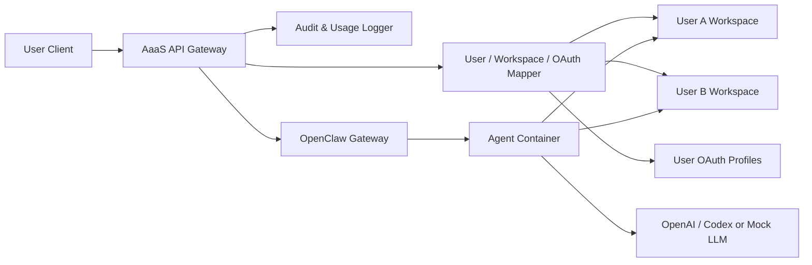

# OpenClaw 기반 Agent-as-a-Service 개발 핸드아웃

## 1. 한 줄 요약

OpenClaw의 컨테이너 기반 에이전트 실행 기능을 바탕으로, 여러 사용자가 각자의 Workspace와 OAuth 인증 정보를 유지하면서 하나의 공용 AI Agent 시스템을 사용하는 Multi-Tenant Agent-as-a-Service 플랫폼을 만든다.

## 2. 문제 상황

OpenClaw 같은 멀티에이전트 시스템을 로컬에서 실행하면 에이전트, 실행 도구, Docker 컨테이너, 모델 호출 환경이 개인 컴퓨터 자원을 많이 사용한다. 팀 단위로 사용하려면 다음 문제가 생긴다.

- 여러 에이전트 실행 시 로컬 CPU와 메모리 부담이 크다.
- 팀원마다 OpenClaw, Docker, 모델 인증 정보를 따로 설정해야 한다.
- 같은 에이전트 시스템을 중복 구축하므로 재현성과 운영 효율이 낮다.
- 로컬 컴퓨터가 꺼지면 에이전트 시스템도 중단된다.
- 사용자별 Workspace, 인증 정보, 사용량을 공용 서비스처럼 분리 관리하기 어렵다.

## 3. 개발 목표

OpenClaw를 단순한 로컬 실행 도구가 아니라 팀이 함께 쓰는 Agent-as-a-Service 구조로 확장한다.

- 에이전트 시스템은 공용 서버 또는 로컬 서버에서 실행한다.
- 사용자는 각자의 Workspace에서만 작업한다.
- 사용자는 각자의 OpenAI 또는 Codex OAuth 인증 정보를 사용한다.
- 에이전트의 실행 도구와 작업 환경은 Docker 컨테이너 안에서 동작한다.
- API Gateway가 사용자 인증, Workspace 라우팅, OAuth 프로필 라우팅, 로그 기록을 담당한다.
- 개발 중에는 Mock LLM을 사용해 모델 비용 없이 구조를 검증한다.

## 4. OpenClaw와의 차별점

OpenClaw는 이미 에이전트를 컨테이너로 격리해서 실행할 수 있다. 따라서 본 프로젝트의 차별점은 “컨테이너 실행” 자체가 아니라, 이 기능을 여러 사용자가 함께 쓰는 서비스 구조로 확장하는 데 있다.

OpenClaw가 제공하는 기반 기능은 에이전트 실행, 에이전트별 컨테이너 격리, OpenAI 호환 Gateway, 모델 인증 프로필 사용이다.

우리 프로젝트가 추가하는 기능은 사용자별 Workspace 라우팅, 사용자별 OAuth 프로필 라우팅, 공용 Agent API Gateway, 사용자별 접근 제어, 실행 요청 및 컨테이너 사용량 로그, Multi-Tenant 서비스 구조이다.

즉, OpenClaw가 “에이전트를 안전하게 실행하는 엔진”이라면, 본 프로젝트는 그 엔진을 여러 사용자가 공유할 수 있는 “공용 Agent 서비스”로 감싸는 작업이다.

## 5. 목표 구조

요청 흐름은 다음과 같다.

1. 사용자가 API Gateway에 에이전트 실행 요청을 보낸다.
2. API Gateway가 사용자 ID를 확인한다.
3. 서버가 사용자별 Workspace와 OAuth 프로필을 매핑한다.
4. 검증된 요청만 OpenClaw Gateway로 전달한다.
5. OpenClaw가 에이전트를 컨테이너 안에서 실행한다.
6. 컨테이너는 해당 사용자의 Workspace를 기준으로 파일 작업과 도구 실행을 수행한다.
7. 실행 결과와 사용량 로그를 기록한다.

## 6. 개발 범위

이번 프로젝트에서는 실제 클라우드 배포보다 로컬 환경에서 Agent-as-a-Service 구조를 재현하는 데 집중한다.

- API Gateway 기본 서버 구현
- 사용자별 Workspace 매핑
- 사용자별 OAuth 프로필 매핑
- OpenClaw Gateway 연동
- 컨테이너 실행 요청 로그
- Mock LLM 기반 테스트 흐름
- 두 명 이상의 사용자 시나리오 데모

이번 범위에서 제외하는 것은 실제 퍼블릭 클라우드 배포 자동화, 실제 과금 시스템, 복잡한 관리자 대시보드, Workspace의 클라우드 저장소화, OpenClaw Gateway의 직접 외부 공개이다.

## 7. Mock LLM 활용 방식

Mock LLM은 실제 OpenAI 모델을 호출하지 않고 고정된 응답을 반환하는 테스트용 모델이다. 이 프로젝트에서는 모델 성능보다 Multi-Tenant 라우팅과 컨테이너 실행 구조 검증이 중요하므로, 개발 중에는 Mock LLM을 기본으로 사용한다.

Mock LLM으로 다음을 확인한다.

- 사용자 A의 요청이 사용자 A Workspace에서 실행되는지
- 사용자 B의 요청이 사용자 B Workspace에서 실행되는지
- 사용자가 다른 사용자의 Workspace에 접근하지 못하는지
- API Gateway가 올바른 OAuth 프로필을 선택하는지
- 에이전트 컨테이너가 정상적으로 생성되고 종료되는지
- 요청 로그와 사용량 로그가 남는지

최종 시연에서는 Mock LLM으로 구조를 먼저 보여준 뒤, 가능하면 실제 OpenAI 또는 Codex OAuth 모델 호출로 전환해 동작을 확인한다.

## 8. 개발 순서

1. OpenClaw 기본 실행 구조를 확인한다.
   - Gateway 요청 처리, 에이전트 선택, Workspace 설정, OAuth 프로필 선택, Docker sandbox 실행 흐름을 파악한다.

2. 최소 사용자 정보를 정의한다.
   - `user_id`, `workspace_path`, `auth_profile_id`, 사용 가능한 agent 목록을 준비한다.

3. API Gateway를 만든다.
   - 사용자 요청을 받고, 사용자 ID를 기준으로 Workspace와 OAuth 프로필을 서버 측에서 매핑한 뒤 OpenClaw로 전달한다.

4. 사용자별 Workspace 라우팅을 구현한다.
   - 사용자마다 다른 로컬 Workspace 디렉터리를 준비하고, 컨테이너가 해당 Workspace만 사용하도록 연결한다.

5. 사용자별 OAuth 프로필 라우팅을 구현한다.
   - 사용자가 직접 `auth_profile_id`를 넘기지 않도록 하고, 서버가 사용자 ID를 기준으로 내부 OAuth 프로필을 선택한다.

6. Mock LLM 테스트를 붙인다.
   - 실제 모델 호출 없이 라우팅, 컨테이너 실행, 로그 기록을 반복 테스트한다.

7. 로그와 사용량 기록을 추가한다.
   - 누가 어떤 agent를 어떤 Workspace에서 실행했는지, 컨테이너가 얼마나 실행됐는지 기록한다.

8. 데모 시나리오를 정리한다.
   - 사용자 A와 B가 같은 agent를 호출하지만 서로 다른 Workspace에서 결과가 생성되는 모습을 보여준다.

## 9. 우선 확인할 OpenClaw 영역

개발을 시작할 때는 OpenClaw 전체를 한 번에 수정하기보다, 요청 흐름과 실행 설정이 모이는 지점을 먼저 확인한다.

우선 확인할 파일 후보는 다음과 같다.

- `external/openclaw/src/gateway/openai-http.ts`
- `external/openclaw/src/gateway/http-utils.ts`
- `external/openclaw/src/agents/agent-scope-config.ts`
- `external/openclaw/src/agents/sandbox/context.ts`
- `external/openclaw/src/agents/model-auth.ts`
- `external/openclaw/src/agents/command/attempt-execution.ts`

이 파일들은 OpenAI 호환 Gateway 요청 처리, 세션 키 처리, Workspace 설정, sandbox context, OAuth 프로필 선택과 관련되어 있다.

## 10. 기대 효과

팀원들은 무거운 에이전트 실행 환경을 각자 로컬에 구성하지 않고 공용 Agent 시스템을 사용할 수 있다. 에이전트는 컨테이너 단위로 실행되므로 실행 환경이 분리되고, 필요할 때만 컨테이너를 실행하는 구조로 확장할 수 있다.

또한 사용자별 Workspace와 OAuth 인증 정보를 분리하므로, 하나의 에이전트 시스템을 여러 사용자가 공유하면서도 각자의 작업 영역과 모델 인증은 독립적으로 유지된다. 향후 퍼블릭 클라우드 배포, 상시 가동, 사용량 기반 비용 산정으로 확장하기에도 적합하다.

## 11. 성공 기준

최소 성공 기준은 다음과 같다.

- 사용자 A와 사용자 B가 같은 Agent API를 호출할 수 있다.
- 두 사용자의 Workspace가 서로 분리된다.
- 사용자는 자신의 Workspace 밖 파일에 접근하지 못한다.
- 사용자별 OAuth 프로필 또는 Mock LLM 설정이 분리된다.
- 에이전트 실행이 Docker 컨테이너 안에서 수행된다.
- 실행 요청과 컨테이너 사용 정보가 로그로 남는다.

이 기준을 만족하면 본 프로젝트는 OpenClaw의 기존 컨테이너 실행 기능을 단순히 사용하는 수준을 넘어, Multi-Tenant Agent-as-a-Service 구조로 확장했다고 볼 수 있다.
