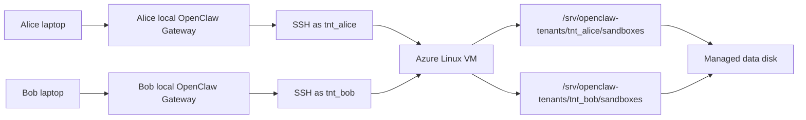

# Agent-as-a-Service 주니어 개발 핸드아웃

## 1. 이번 개발의 한 줄 요약

여러 사용자가 각자 자기 노트북에서 OpenClaw Gateway를 실행하고, 실제 agent tool 실행은 Azure VM의 공용 SSH sandbox host에서 수행하게 만든다. 각 사용자는 자기 tenant workspace만 읽고 쓸 수 있어야 한다.

이번 프로젝트의 핵심은 대규모 트래픽 처리나 완전한 SaaS 운영이 아니다. 핵심은 다음 문장을 실제로 증명하는 것이다.

> 여러 명의 사용자가 로컬 Gateway를 가지고 하나의 클라우드 에이전트 실행 환경에 접근하며, 각 사용자는 개별적인 workspace를 가진다.

1차 목표 사용자는 2-3명 정도다. load balancing, autoscaling, billing, 복잡한 관리자 화면은 이번 범위에서 제외한다.

## 2. 왜 이 개발을 하는가

OpenClaw는 원래 local-first agent harness다. 사용자는 자기 컴퓨터에서 Gateway를 실행하고, Gateway는 agent 실행, tool 호출, session 관리, model auth, channel integration 같은 control plane 역할을 한다.

그런데 agent가 shell command를 실행하거나 파일을 읽고 쓰는 작업은 로컬 컴퓨터 자원과 환경에 의존한다. 팀이나 여러 사용자가 같은 agent 실행 환경을 공유하고 싶으면 다음 문제가 생긴다.

- 각 사용자 컴퓨터마다 Docker, tool, runtime을 설치해야 한다.
- 사용자마다 실행 환경이 달라서 재현성이 낮다.
- 무거운 작업이 사용자 노트북에서 돌아간다.
- 여러 사용자가 하나의 agent system을 공유하되 workspace는 분리해야 한다.
- 한 사용자의 agent가 다른 사용자의 파일을 읽거나 쓰면 안 된다.

이 프로젝트는 OpenClaw의 기존 SSH sandbox backend를 활용해서 이 문제를 풀어보는 연구/구현이다. OpenClaw core를 크게 고치지 않고, 클라우드 쪽에 SSH로 접근 가능한 실행 host를 두고, 각 사용자의 local Gateway가 그 host로 tool 실행을 보내도록 구성한다.

## 3. 최종 결정된 MVP 구조

이번 1차 구현은 아래 구조로 간다.

- 사용자: 각자 로컬 머신에서 OpenClaw Gateway 실행
- 클라우드 실행 환경: Azure Linux VM 1대
- 저장소: Azure VM에 붙인 managed data disk
- workspace root: `/srv/openclaw-tenants/<tenantId>/sandboxes`
- 사용자 격리: tenant별 Linux user + tenant별 SSH key pair + `chmod 700`
- tenant 등록: `tenants.json`
- provisioning: tenant별 user, key, workspace, config snippet을 만들어주는 script
- OpenClaw core 수정: 하지 않음
- OpenClaw sandbox backend: 기존 `backend: "ssh"` 사용
- Azure Files, Container Apps, ACI: 2차 확장 후보로 보류

전체 그림은 다음과 같다.



사용자 입장에서 보면 “내 로컬 Gateway가 클라우드 agent system을 사용한다”처럼 보인다. 내부적으로는 OpenClaw Gateway가 SSH backend를 통해 Azure VM에 접속해서 shell/file tool을 실행한다.

## 4. 꼭 이해해야 하는 OpenClaw 개념

### Gateway

Gateway는 OpenClaw의 control plane이다. 사용자의 메시지, agent session, model auth, tool 호출 orchestration, Control UI, channel integration 등을 담당한다.

이번 프로젝트에서 Gateway는 클라우드로 올리지 않는다. 각 사용자의 로컬 컴퓨터에서 실행한다.

### Sandbox backend

OpenClaw sandbox는 Gateway 전체를 감싸는 기능이 아니다. agent가 사용하는 shell/file/browser 같은 tool 실행을 별도 backend에서 실행하게 만드는 기능이다.

이번에는 Docker backend가 아니라 SSH backend를 쓴다.

### Docker backend와 SSH backend의 차이

Docker backend는 local Docker daemon에 `docker create`, `docker start`, `docker exec`를 호출한다. 그래서 remote container URL을 넣어서 바로 쓰는 구조가 아니다.

SSH backend는 SSH target에 접속해서 remote shell command를 실행한다. 이번 프로젝트의 cloud 구조와 잘 맞는다.

### workspaceRoot

OpenClaw SSH backend는 `workspaceRoot` 아래에 runtime별 workspace를 만든다.

예를 들어 Alice의 config가 다음과 같으면:

```json5
workspaceRoot: "/srv/openclaw-tenants/tnt_alice/sandboxes"
```

OpenClaw는 그 아래에 session별 runtime directory를 만들고, 실제 command와 file tool을 그 workspace 안에서 실행한다.

### scope

이번 프로젝트에서는 `scope: "session"`을 기본값으로 쓴다.

- `session`: session마다 remote runtime directory가 분리된다. 테스트와 데모에 가장 좋다.
- `agent`: agent 단위로 workspace가 유지된다.
- `shared`: 여러 session이 같은 root를 공유한다. multi-tenant 격리에 맞지 않으므로 쓰지 않는다.

## 5. 사용자 격리 방식

가장 중요한 원칙은 이것이다.

> 사용자의 local Gateway를 신뢰하지 않는다.

사용자는 자기 컴퓨터에서 OpenClaw config를 마음대로 바꿀 수 있다. 따라서 “Alice Gateway가 `workspaceRoot`를 Alice 경로로 설정했으니 안전하다”라고 믿으면 안 된다.

실제 격리는 Azure VM의 Linux 권한으로 강제한다.

### tenant별 Linux user

각 tenant마다 Linux user를 만든다.

예:

```text
tnt_alice
tnt_bob
tnt_charlie
```

각 user는 자기 workspace만 소유한다.

```text
/srv/openclaw-tenants/
  tnt_alice/   owner: tnt_alice, mode: 700
  tnt_bob/     owner: tnt_bob,   mode: 700
```

`chmod 700`이면 owner만 읽기/쓰기/실행이 가능하다. Alice가 Bob directory를 읽으려고 하면 permission denied가 나야 한다.

### tenant별 SSH key

각 tenant마다 SSH key pair를 따로 만든다.

예:

```text
keys/
  tnt_alice
  tnt_alice.pub
  tnt_bob
  tnt_bob.pub
```

Alice의 public key는 VM의 `~tnt_alice/.ssh/authorized_keys`에 들어간다. Bob의 public key는 `~tnt_bob/.ssh/authorized_keys`에 들어간다.

Alice가 Bob 계정으로 접속할 수 있으면 안 된다.

### raw user id를 경로로 쓰지 않기

PoC에서는 `alice`, `bob`처럼 써도 되지만, 실제 설계에서는 email이나 OAuth subject를 경로명으로 직접 쓰지 않는다.

좋은 예:

```text
userId: alice@example.com
tenantId: tnt_alice
path: /srv/openclaw-tenants/tnt_alice
```

더 운영적인 예:

```text
tenantId: tnt_01J7M8K2...
```

이번 프로젝트에서는 읽기 쉬운 `tnt_alice`, `tnt_bob`을 써도 된다.

## 6. 만들어야 할 산출물

주니어 개발자가 실제로 만들 것은 다음이다.

### tenants.json

사용자와 tenant id를 정의하는 파일이다.

예:

```json
{
  "users": [
    {
      "userId": "alice",
      "tenantId": "tnt_alice"
    },
    {
      "userId": "bob",
      "tenantId": "tnt_bob"
    }
  ]
}
```

이 파일은 1차 구현에서 간단한 Tenant Broker 역할을 한다. 나중에는 웹 로그인/API/DB로 바꿀 수 있다.

### provisioning script

Azure VM에서 실행할 script다. `tenants.json`을 읽고 다음을 만든다.

- tenant별 Linux user
- tenant별 workspace root
- tenant별 SSH key pair
- tenant별 `authorized_keys`
- tenant별 OpenClaw config snippet

script 이름 예:

```text
scripts/provision-tenants.sh
```

또는 Python이 편하면:

```text
scripts/provision_tenants.py
```

### generated config snippets

각 사용자에게 전달할 OpenClaw sandbox 설정 조각이다.

Alice 예:

```json5
{
  agents: {
    defaults: {
      sandbox: {
        mode: "all",
        backend: "ssh",
        scope: "session",
        workspaceAccess: "rw",
        ssh: {
          target: "tnt_alice@<azure-vm-host>:22",
          workspaceRoot: "/srv/openclaw-tenants/tnt_alice/sandboxes",
          strictHostKeyChecking: true,
          updateHostKeys: true,
          identityFile: "~/.ssh/openclaw_aaas_tnt_alice",
          knownHostsFile: "~/.ssh/known_hosts"
        }
      }
    }
  }
}
```

Bob은 `target`, `workspaceRoot`, `identityFile`만 자기 tenant 값으로 달라진다.

### verification notes

테스트 결과를 남기는 간단한 Markdown 파일도 있으면 좋다.

예:

```text
reports/plan/AaaS_VM_Sandbox_검증_기록.md
```

여기에는 Alice/Bob 각각 어떤 command를 실행했고, 어떤 파일이 생성됐고, cross-access가 어떻게 실패했는지 기록한다.

## 7. Azure VM 준비 순서

### 7.1 VM 만들기

Azure Linux VM 1대를 만든다. Ubuntu LTS를 권장한다.

필수 조건:

- SSH 접속 가능
- public IP 또는 접근 가능한 private network
- OpenSSH server 설치
- `bash`, `python3`, `git`, `curl`, `jq`, `ripgrep` 설치

이번 PoC에서는 VM 1대면 충분하다.

### 7.2 managed data disk 붙이기

workspace는 VM temporary disk에 두면 안 된다. temporary disk는 VM lifecycle 중 데이터가 사라질 수 있다.

managed data disk를 붙이고 `/srv/openclaw-tenants`에 mount한다.

예상 결과:

```bash
df -h /srv/openclaw-tenants
mount | grep /srv/openclaw-tenants
```

위 명령으로 `/srv/openclaw-tenants`가 별도 managed disk mount인지 확인한다.

### 7.3 기본 디렉토리 만들기

```bash
sudo mkdir -p /srv/openclaw-tenants
sudo chmod 755 /srv/openclaw-tenants
```

tenant별 root는 provisioning script가 만든다.

## 8. Provisioning script가 해야 할 일

script는 tenant마다 아래 작업을 수행한다.

1. tenant id 검증
2. Linux user 생성
3. workspace directory 생성
4. directory owner/mode 설정
5. SSH key pair 생성
6. public key를 `authorized_keys`에 등록
7. OpenClaw config snippet 출력

### 8.1 tenant id 검증

tenant id는 안전한 문자만 허용한다.

허용 예:

```text
tnt_alice
tnt_bob
tnt_01J7M8K2
```

금지 예:

```text
../bob
alice@example.com
tnt alice
/tmp/foo
```

정규식 예:

```text
^tnt_[a-zA-Z0-9_-]+$
```

이 검증은 매우 중요하다. 경로를 만드는 script가 이상한 tenant id를 그대로 쓰면 path traversal 문제가 생길 수 있다.

### 8.2 Linux user 생성

예:

```bash
sudo useradd --create-home --shell /bin/bash tnt_alice
```

이미 존재하면 넘어가도 된다. script는 여러 번 실행해도 크게 망가지지 않는 idempotent 방식이면 좋다.

### 8.3 workspace directory 생성

예:

```bash
sudo mkdir -p /srv/openclaw-tenants/tnt_alice/sandboxes
sudo mkdir -p /srv/openclaw-tenants/tnt_alice/workspace
sudo chown -R tnt_alice:tnt_alice /srv/openclaw-tenants/tnt_alice
sudo chmod 700 /srv/openclaw-tenants/tnt_alice
```

핵심은 tenant root가 `700`이라는 점이다.

### 8.4 SSH key 생성

예:

```bash
ssh-keygen -t ed25519 -f ./keys/openclaw_aaas_tnt_alice -N ""
```

public key를 tenant user의 `authorized_keys`에 추가한다.

```bash
sudo mkdir -p /home/tnt_alice/.ssh
sudo cp ./keys/openclaw_aaas_tnt_alice.pub /home/tnt_alice/.ssh/authorized_keys
sudo chown -R tnt_alice:tnt_alice /home/tnt_alice/.ssh
sudo chmod 700 /home/tnt_alice/.ssh
sudo chmod 600 /home/tnt_alice/.ssh/authorized_keys
```

private key는 사용자에게 전달할 파일이다. Git에 commit하면 안 된다.

## 9. Local Gateway 설정 순서

각 사용자는 자기 로컬 머신에 private key를 둔다.

예:

```text
~/.ssh/openclaw_aaas_tnt_alice
```

권한 설정:

```bash
chmod 600 ~/.ssh/openclaw_aaas_tnt_alice
```

SSH 접속 확인:

```bash
ssh -i ~/.ssh/openclaw_aaas_tnt_alice tnt_alice@<azure-vm-host>
```

접속이 되면 OpenClaw config에 SSH sandbox 설정을 넣는다.

검증 명령:

```bash
openclaw sandbox explain
```

이 명령에서 `backend: ssh`와 tenant별 workspace root가 보이면 좋다.

## 10. 개발 순서

### Phase 0: OpenClaw SSH backend 이해

먼저 OpenClaw가 SSH backend를 어떻게 쓰는지 확인한다.

확인할 파일:

- `external/openclaw/docs/gateway/sandboxing.md`
- `external/openclaw/src/agents/sandbox/context.ts`
- `external/openclaw/src/agents/sandbox/ssh-backend.ts`
- `external/openclaw/src/agents/sandbox/remote-fs-bridge.ts`

이 단계에서는 코드를 고치지 않는다. “OpenClaw는 SSH backend에 어떤 설정을 기대하는가”만 이해하면 된다.

### Phase 1: Azure VM + data disk 준비

Azure VM을 만들고 `/srv/openclaw-tenants`를 managed data disk에 mount한다.

성공 기준:

- VM에 SSH 접속 가능
- `/srv/openclaw-tenants` 존재
- VM reboot 후 `/srv/openclaw-tenants/manual.txt` 같은 테스트 파일 유지

### Phase 2: tenants.json 만들기

처음에는 사용자 2명만 넣는다.

```json
{
  "users": [
    { "userId": "alice", "tenantId": "tnt_alice" },
    { "userId": "bob", "tenantId": "tnt_bob" }
  ]
}
```

성공 기준:

- tenant id가 정규식 검증을 통과한다.
- 중복 tenant id가 있으면 script가 실패한다.

### Phase 3: provisioning script 구현

`tenants.json`을 읽고 tenant별 Linux user, SSH key, workspace를 만든다.

성공 기준:

- `id tnt_alice` 성공
- `/srv/openclaw-tenants/tnt_alice` owner가 `tnt_alice`
- `/srv/openclaw-tenants/tnt_alice` mode가 `700`
- Alice private key로 `ssh tnt_alice@host` 가능
- Alice private key로 `ssh tnt_bob@host` 불가

### Phase 4: OpenClaw config snippet 생성

script가 사용자별 snippet을 생성한다.

파일 예:

```text
generated/openclaw-config-tnt_alice.json5
generated/openclaw-config-tnt_bob.json5
```

성공 기준:

- Alice snippet의 `target`은 `tnt_alice@...`
- Alice snippet의 `workspaceRoot`는 `/srv/openclaw-tenants/tnt_alice/sandboxes`
- Bob snippet은 Bob 값으로 분리됨

### Phase 5: local Gateway에서 cloud sandbox 실행

Alice와 Bob 각각 로컬 Gateway에 snippet을 반영한다.

Alice agent에게 요청:

```bash
pwd
echo alice > proof.txt
cat proof.txt
```

Bob agent에게 요청:

```bash
pwd
echo bob > proof.txt
cat proof.txt
```

VM에서 확인:

```bash
sudo find /srv/openclaw-tenants -name proof.txt -print -exec cat {} \;
```

성공 기준:

- Alice 파일은 Alice tenant root 아래에 생성된다.
- Bob 파일은 Bob tenant root 아래에 생성된다.
- 두 파일 내용이 섞이지 않는다.

### Phase 6: cross-access 실패 검증

Alice 계정으로 Bob workspace에 접근을 시도한다.

예:

```bash
sudo -u tnt_alice bash -lc 'ls /srv/openclaw-tenants/tnt_bob'
```

성공 기준:

- permission denied가 발생한다.
- Bob 계정도 Alice workspace를 볼 수 없다.

OpenClaw agent를 통해서도 비슷한 시도를 해본다.

예:

```bash
ls /srv/openclaw-tenants/tnt_bob
```

Alice agent session에서 이 명령이 실패해야 한다.

## 11. 데모 시나리오

최종 발표 또는 내부 리뷰에서는 아래 흐름을 보여주면 된다.

1. `tenants.json`에 Alice/Bob이 있다.
2. provisioning script를 실행한다.
3. Azure VM에 `tnt_alice`, `tnt_bob` Linux user가 생긴다.
4. `/srv/openclaw-tenants/tnt_alice`, `/srv/openclaw-tenants/tnt_bob`가 분리되어 있다.
5. Alice local Gateway에서 cloud sandbox로 명령을 실행한다.
6. Bob local Gateway에서 cloud sandbox로 명령을 실행한다.
7. VM에서 두 tenant의 `proof.txt`가 서로 다른 위치에 있음을 보여준다.
8. Alice가 Bob workspace를 읽으려 하면 실패한다.
9. VM reboot 후 파일이 남아 있음을 보여준다.

이 데모가 성공하면 이번 프로젝트의 핵심 목표는 달성한 것이다.

## 12. 이번 범위에서 하지 않는 것

다음은 일부러 하지 않는다.

- OpenClaw core 수정
- Docker backend를 remote URL backend로 바꾸기
- Azure Container Apps 배포
- Azure Files 기반 shared storage
- browser sandbox cloud 이전
- 여러 VM load balancing
- 결제/사용량 과금
- 완전한 웹 로그인 시스템
- 관리자 대시보드

이것들을 하지 않는 이유는, 지금 목표가 “2-3명의 실제 사용자가 local Gateway로 cloud sandbox를 안전하게 공유할 수 있는가”를 검증하는 것이기 때문이다.

## 13. 자주 헷갈리는 지점

### agent container를 클라우드에 올리는 것인가?

정확히는 아니다. 이번 1차 구현에서는 Azure VM이 remote tool execution host다. OpenClaw agent loop와 Gateway는 사용자 로컬에 있다. shell/file tool이 SSH를 통해 Azure VM에서 실행된다.

### workspace는 URL인가?

아니다. OpenClaw 입장에서 workspace는 remote POSIX path다.

예:

```text
/srv/openclaw-tenants/tnt_alice/sandboxes
```

### SSH sandbox만으로 사용자 격리가 충분한가?

OpenClaw의 SSH backend는 workspace path와 file bridge로 격리를 돕지만, 악의적인 local Gateway 사용자까지 막으려면 OS 권한이 필요하다. 그래서 tenant별 Linux user와 `chmod 700`이 필수다.

### 왜 Azure Files가 아니라 managed data disk인가?

이번 목표는 2-3명 사용자 격리 검증이다. Azure VM managed disk가 Linux permission과 SSH user 검증이 가장 단순하다. Azure Files는 여러 VM이 같은 storage를 공유해야 할 때 2차로 검토한다.

### 왜 OpenClaw를 수정하지 않는가?

이미 SSH backend가 있기 때문이다. 1차 목표는 OpenClaw core 개발이 아니라 cloud 실행 환경과 tenant workspace 분리를 검증하는 것이다.

## 14. 체크리스트

개발이 끝났다고 말하려면 아래를 모두 만족해야 한다.

- `tenants.json`에 Alice/Bob 등록
- provisioning script 실행 성공
- tenant별 Linux user 생성
- tenant별 SSH key pair 생성
- tenant별 workspace root 생성
- tenant root owner/mode 설정 확인
- Alice key로 Alice SSH 접속 성공
- Alice key로 Bob SSH 접속 실패
- Alice local Gateway에서 SSH sandbox 실행 성공
- Bob local Gateway에서 SSH sandbox 실행 성공
- Alice/Bob `proof.txt`가 서로 다른 tenant root에 생성
- Alice가 Bob workspace 읽기 실패
- VM reboot 후 proof 파일 유지
- 검증 기록 Markdown 작성

## 15. 참고 문서

더 자세한 설계 판단은 다음 문서를 본다.

- `reports/plan/OpenClaw_Cloud_Sandbox_검토.md`
- `external/openclaw/docs/gateway/sandboxing.md`
- `external/openclaw/src/agents/sandbox/ssh-backend.ts`

Azure 쪽 공식 문서는 다음을 참고한다.

- [Azure Managed Disks overview](https://learn.microsoft.com/en-us/Azure/virtual-machines/managed-disks-overview)
- [Format and mount managed disks to Azure Linux VMs](https://learn.microsoft.com/en-us/azure/virtual-machines/linux/disks-format-mount-data-disks-linux)

