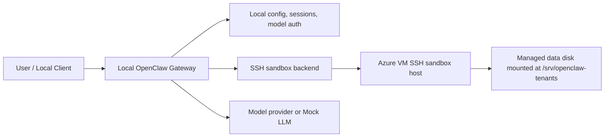
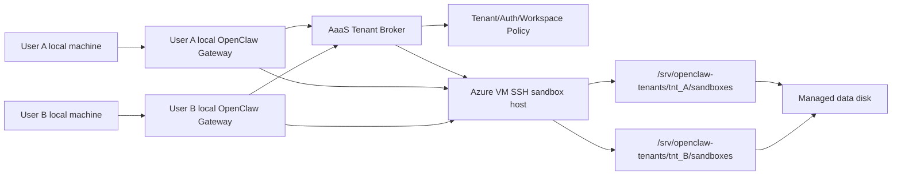

# OpenClaw Cloud Sandbox 개발 가능성 검토

## 1. 검토 결론

결론부터 말하면, OpenClaw 기반 agent harness를 클라우드 서비스로 전환하는 PoC는 가능하다. 다만 사용자가 처음 가정한 “OpenClaw Docker sandbox를 그대로 켜고, agent container와 workspace를 URL로 찾아가게 한다”는 방식은 현재 OpenClaw 구조와 다르다.

현재 OpenClaw의 Docker sandbox는 Gateway가 로컬 Docker daemon에 `docker create`, `docker start`, `docker exec`를 호출해서 sandbox container를 만들고 제어하는 구조다. Gateway는 container name/runtime id와 workspace path를 알고 있지만, remote container URL을 저장해두고 HTTP로 명령을 보내는 구조는 아니다.

따라서 이번 연구의 현실적인 목표는 다음과 같이 잡는 것이 좋다.

- MVP: 기존 `backend: "ssh"`를 사용해 local Gateway가 Azure의 remote sandbox 환경에 SSH로 접속한다.
- Workspace: 1차 구현은 Azure VM의 managed data disk에 tenant별 workspace를 만든다. Azure Files는 2차 확장으로 둔다.
- AaaS 확장: 불특정 다수 사용자는 각자 local Gateway를 실행하되, provisioning script가 tenant id, SSH key pair, workspace root, OpenClaw config snippet을 발급한다.
- 검증 범위: shell/file tool이 Azure VM에서 실행되고, 결과 파일이 사용자별 tenant workspace에 분리되어 남는지 확인한다.
- 후속 연구: Docker/HTTP/URL 기반 cloud-native sandbox backend는 별도 신규 backend 개발 항목으로 분리한다.

즉, “OpenClaw의 Docker sandbox를 그대로 cloud URL화”하는 것은 바로 가능하지 않지만, “OpenClaw의 sandbox backend 추상화 중 SSH backend를 사용해 cloud sandbox로 전환”하는 것은 가능하다. 다만 불특정 다수 사용자가 붙는 Agent as a Service로 확장하려면 local Gateway를 신뢰하면 안 된다. 사용자 id와 workspace path는 cloud 쪽에서 검증하고, OS/storage 권한으로 강제해야 한다.

## 2. OpenClaw 개념 검증

### 2.1 Gateway는 sandbox 밖에 남는다

OpenClaw 문서상 sandboxing은 Gateway 전체를 감싸는 기능이 아니라, tool execution을 sandbox backend 안에서 실행해 blast radius를 줄이는 기능이다. `external/openclaw/docs/gateway/sandboxing.md`는 Gateway가 host에 남고, tool execution이 sandbox에서 동작한다고 설명한다.

이 의미는 중요하다. 사용자가 말한 “agent가 컨테이너로 감싸진다”는 표현은 반쯤 맞지만, 정확히는 “agent turn에서 사용하는 shell/file/browser 관련 tool 실행이 sandbox runtime으로 라우팅된다”에 가깝다. Gateway, session routing, channel integration, model/auth/session store, Control UI는 기본적으로 Gateway 프로세스 쪽 책임이다.

### 2.2 Docker backend는 local Docker daemon 제어 모델이다

Docker backend의 핵심 흐름은 다음 코드에서 확인된다.

- `external/openclaw/src/agents/sandbox/context.ts`: session key와 sandbox 설정을 기반으로 `resolveSandboxContext`를 만들고 backend factory를 호출한다.
- `external/openclaw/src/agents/sandbox/docker-backend.ts`: `ensureSandboxContainer`로 Docker container를 준비하고, `buildDockerExecArgs`로 `docker exec` argv를 만든다.
- `external/openclaw/src/agents/sandbox/docker.ts`: container 생성 시 `docker create`, 시작 시 `docker start`, 실행 시 `docker exec` 계열 명령을 사용한다.
- `external/openclaw/src/agents/sandbox/workspace-mounts.ts`: workspace path를 `-v hostPath:containerPath` 형태로 container에 bind mount한다.

따라서 Docker backend에서 Gateway가 “찾아가는 대상”은 URL이 아니라 Docker daemon이 관리하는 container name이다. `runtimeId`나 `containerName`은 Docker container name으로 쓰이며, remote service endpoint가 아니다.

현재 구조에서 Docker backend를 Azure Container Apps나 ACI의 remote container URL로 직접 연결하려면 다음 문제가 생긴다.

- OpenClaw는 HTTP API가 아니라 `docker` CLI/daemon protocol을 기대한다.
- `docker exec`와 동일한 streaming stdin/stdout/stderr semantics가 필요하다.
- bind mount source path는 Docker daemon이 실행되는 host namespace 기준이어야 한다.
- Azure Files mount path는 URL이 아니라 container/VM 내부 파일시스템 path로 보여야 한다.

### 2.3 workspaceAccess 의미

OpenClaw sandbox의 `workspaceAccess`는 sandbox가 어떤 workspace를 볼 수 있는지 결정한다.

- `none`: agent workspace를 직접 mount하지 않고 sandbox workspace를 사용한다.
- `ro`: agent workspace를 `/agent`에 read-only로 mount하고 쓰기는 제한한다.
- `rw`: agent workspace를 sandbox workdir, 기본값 `/workspace`, 에 read/write로 mount한다.

Docker backend에서는 `workspace-mounts.ts`가 이 값을 기준으로 bind mount의 read-only 여부를 결정한다. SSH backend에서는 Docker mount가 아니라 remote directory layout과 remote filesystem bridge가 같은 역할을 한다.

이번 Azure PoC에서는 결과 파일을 VM managed data disk의 tenant workspace에 남기는 것이 목표이므로 `workspaceAccess: "rw"`가 가장 단순하다. 이때 OpenClaw는 remote workspace를 실제 작업공간으로 보고 file/write/edit/exec 결과를 그 경로에 남기게 된다.

### 2.4 SSH backend는 cloud PoC와 잘 맞는다

OpenClaw에는 이미 `backend: "ssh"`가 있다. `external/openclaw/src/agents/sandbox/ssh-backend.ts`를 보면 remote runtime path를 다음처럼 만든다.

- runtime root: `<workspaceRoot>/<runtimeId>`
- remote workspace: `<runtimeRoot>/workspace`
- remote agent workspace: `<runtimeRoot>/agent`

그리고 `buildExecRemoteCommand`, `buildSshSandboxArgv`, `runSshSandboxCommand`를 사용해 remote shell command를 실행한다. file tool도 remote filesystem bridge를 통해 실행된다.

따라서 Azure 쪽에 SSH 가능한 Linux VM을 만들고 managed data disk를 `/srv/openclaw-tenants`에 mount하면, OpenClaw는 다음 구조로 동작할 수 있다.



### 2.5 SSH sandbox는 무엇으로 격리하는가

부가 질문에 대한 답은 “OpenClaw SSH backend 자체는 container namespace를 새로 만드는 격리 장치가 아니라, SSH target 안의 remote directory와 filesystem bridge 정책으로 작업공간을 나누는 방식”이다.

현재 코드 기준 SSH backend의 격리 요소는 다음이다.

- `scope`에 따라 runtime id를 만들고, remote path를 `<workspaceRoot>/<runtimeId>/workspace`로 분리한다.
  - `scope: "session"`이면 session key별 remote root를 쓴다.
  - `scope: "agent"`이면 `agent:<agentId>` 기준 remote root를 쓴다.
  - `scope: "shared"`이면 모두 `shared` root를 쓰므로 multi-tenant 격리에는 맞지 않는다.
- `workspaceAccess`에 따라 write 가능 여부와 agent workspace 노출 방식을 제한한다.
- file tool은 remote filesystem bridge와 path guard를 통해 workspace root 밖 접근을 막도록 설계되어 있다.
- `exec`는 SSH target에서 shell command로 실행되므로, 실제 process/resource/network 격리는 SSH target의 OS 계정, container, VM, chroot, cgroup, network policy에 달려 있다.

따라서 같은 SSH Unix account를 모든 사용자에게 나눠주고 같은 `workspaceRoot`를 쓰게 하면 강한 격리가 아니다. 특히 각 사용자가 자기 local Gateway를 직접 제어하는 AaaS 모델에서는 사용자가 OpenClaw config를 바꿔 다른 workspace root를 지정할 수도 있다. 그러므로 multi-tenant AaaS에서는 OpenClaw의 path guard만 믿지 말고, cloud 쪽에서 다음 중 하나를 반드시 적용해야 한다.

- tenant별 Unix account와 `chmod 700` workspace
- tenant별 container/VM
- tenant별 Azure Files share
- tenant별 mount credential 또는 storage ACL
- SSH certificate/short-lived credential과 server-side policy

요약하면, SSH backend는 OpenClaw 레벨에서 workspace 경로를 나누지만, 불특정 다수 사용자 격리는 cloud OS/storage 권한으로 보강해야 한다.

## 3. 가능/불가능 판정

| 항목 | 판정 | 설명 |
| --- | --- | --- |
| OpenClaw Docker sandbox를 local에서 켜는 것 | 가능 | 기존 Docker backend가 지원한다. |
| Docker sandbox container와 workspace를 local Docker volume/bind mount로 연결 | 가능 | 현재 구현의 기본 모델이다. |
| Gateway가 remote container URL로 Docker sandbox를 직접 제어 | 현재 구조로는 불가 | Docker backend는 URL이 아니라 local Docker daemon/container name을 기대한다. |
| Azure VM managed data disk를 workspace 저장소로 사용 | 가능, 1차 구현으로 채택 | Unix account와 file permission 검증이 단순하고 현재 목표에 충분하다. |
| Azure Files를 workspace 저장소로 사용 | 가능, 2차 확장 | 여러 VM 공유나 managed file service가 필요해질 때 검토한다. |
| local Gateway가 Azure container/VM에 SSH로 접속해 tool 실행 | 가능 | 기존 `backend: "ssh"`와 잘 맞는다. |
| 불특정 다수 사용자가 각자 local Gateway로 공용 cloud agent runtime 사용 | 가능, 이번 목표 | `tenants.json`, provisioning script, tenant별 Unix account/key/workspace로 구현한다. |
| 단일 VM data disk 아래 `<tenantId>/...` 하위 디렉토리로 workspace 분리 | 가능, 이번 목표 | raw user id 대신 tenant id를 쓰고 Unix permission으로 강제한다. |
| Azure Container Apps에 SSH sandbox를 올리는 것 | PoC 가능, 운영은 주의 | TCP ingress와 고정 replica 설정이 필요하다. SSH 공개 노출은 위험하므로 private network/VPN 권장. |
| ACI 또는 VM에 SSH sandbox를 올리는 것 | 가능 | VM은 고정 endpoint와 Linux permission 검증이 가장 쉽고 이번 구현으로 채택한다. |
| browser sandbox까지 Azure로 이전 | 이번 범위 제외 | OpenClaw 문서상 SSH backend는 browser sandbox를 지원하지 않는다. |
| 완전 cloud-native HTTP sandbox backend | 신규 개발 필요 | OpenClaw backend interface 구현, remote exec streaming, file bridge, auth, lifecycle manager가 필요하다. |

## 4. 추천 Azure PoC 아키텍처

### 4.1 권장 구조

이번 프로젝트에서 채택한 1차 구현 구조는 다음이다.

1. OpenClaw Gateway는 local machine에서 실행한다.
2. OpenClaw sandbox backend는 `ssh`로 설정한다.
3. Azure에는 Linux VM 1대를 띄운다.
4. VM에 managed data disk를 붙이고 `/srv/openclaw-tenants`에 mount한다.
5. tenant별 Unix account와 `/srv/openclaw-tenants/<tenantId>/sandboxes`를 만든다.
6. OpenClaw 설정의 `sandbox.ssh.workspaceRoot`를 tenant별 `sandboxes` path로 둔다.
7. agent의 `exec`, `read`, `write`, `edit` 결과가 tenant별 workspace에 남는지 확인한다.

이 구조에서 “workspace를 URL로 찾는다”는 표현은 정확하지 않다. OpenClaw 입장에서는 workspace가 URL이 아니라 remote VM 안의 POSIX path다. managed data disk는 그 path 뒤에 붙은 persistent block storage로 동작한다.

### 4.2 Azure 서비스 선택

| 선택지 | 장점 | 주의점 | 추천도 |
| --- | --- | --- | --- |
| Azure VM | SSH와 파일시스템 semantics가 가장 단순 | VM 관리 부담이 있음 | 가장 안정적인 PoC |
| Azure Container Instances | container 단위 실행과 Azure Files mount가 단순 | SSH daemon을 직접 이미지에 넣고 port 노출 필요 | PoC에 적합 |
| Azure Container Apps | Azure Files mount, ingress, scale 설정 가능 | SSH/TCP ingress, replica 고정, revision 관리가 복잡 | 가능하지만 조심 |
| Azure Container Apps Jobs | 작업 단위 실행에 적합 | OpenClaw의 long-lived SSH backend와 잘 맞지 않음 | 이번 구조에는 비추천 |

최종 결정은 Azure VM 1대 + managed data disk다. 2-3명 테스트에서는 load balancing이 필요 없고, 이 조합이 SSH, Unix account, file permission, reboot persistence를 가장 단순하게 검증할 수 있다. VM의 temporary disk는 lifecycle 중 데이터가 사라질 수 있으므로 workspace에는 사용하지 않는다.

Container Apps를 쓰는 경우에는 `minReplicas=1`, `maxReplicas=1`을 권장한다. SSH target이 replica scaling으로 바뀌면 session state와 mounted workspace visibility 검증이 어려워진다. 또한 TCP ingress를 외부로 열 경우 IP restrictions, VPN, Tailscale, private VNet 중 하나로 접근을 제한해야 한다.

### 4.3 OpenClaw 설정 예시

아래는 문법 방향을 보여주는 예시다. 실제 `target`, key, known_hosts 경로는 환경에 맞게 바꿔야 한다.

```json5
{
  agents: {
    defaults: {
      sandbox: {
        mode: "all",
        backend: "ssh",
        scope: "session",
        workspaceAccess: "rw",
        ssh: {
          target: "tnt_alice@<azure-vm-host>:22",
          workspaceRoot: "/srv/openclaw-tenants/tnt_alice/sandboxes",
          strictHostKeyChecking: true,
          updateHostKeys: true,
          identityFile: "~/.ssh/openclaw_aaas_tnt_alice",
          knownHostsFile: "~/.ssh/known_hosts"
        }
      }
    }
  }
}
```

`scope`는 연구 목적에 따라 선택한다.

- `session`: 실행마다 분리가 잘 보여서 검증에 좋다.
- `agent`: 같은 agent의 작업 상태를 유지하는 데 좋다.
- `shared`: 격리 효과가 약해지므로 이번 PoC에서는 비추천한다.

## 5. Agent as a Service 다중 사용자 확장

### 5.1 목표 구조

추가 요구사항을 반영한 최종 1차 구조는 다음과 같다.



사용자는 각자 로컬에서 OpenClaw Gateway를 실행한다. 이 Gateway는 model auth, session, local UI 같은 control plane을 계속 담당한다. cloud에는 agent tool runtime과 workspace storage가 있다. 1차 구현에서는 완전한 로그인 서비스 대신 `tenants.json`과 provisioning script를 broker 역할로 사용한다. script는 사용자별 tenant id, Linux user, SSH key pair, workspace root, OpenClaw config snippet을 만든다.

중요한 점은 local Gateway가 `userId`와 `workspaceRoot`를 주장하는 구조가 아니라는 것이다. local Gateway는 사용자가 제어할 수 있으므로 신뢰할 수 없다. 실제 권한 판단은 broker와 cloud runtime의 OS/storage 권한이 해야 한다.

### 5.2 tenant workspace 설계

가장 쉬운 방법은 VM managed data disk mount 아래에 사용자별 하위 디렉토리를 만드는 것이다.

```text
/srv/openclaw-tenants/
  tnt_alice/
    sandboxes/
    workspace/
  tnt_bob/
    sandboxes/
    workspace/
```

PoC에서는 `tnt_alice`, `tnt_bob`처럼 알아보기 쉬운 tenant id를 써도 된다. 다만 email, phone number, provider subject 같은 raw user id를 경로명으로 직접 쓰지 않는 것이 좋다. 내부 tenant id를 발급해 `tnt_<name>` 또는 `tnt_<uuid>` 형태로 저장하고, `tenants.json`에서 실제 사용자 id와 매핑한다.

권장안은 다음 순서다.

| 방식 | 설명 | 장점 | 단점 |
| --- | --- | --- | --- |
| VM data disk + tenant 하위 디렉토리 | `/srv/openclaw-tenants/<tenantId>` | 이번 목표에 충분하고 권한 검증이 단순 | VM 1대에 종속됨 |
| VM data disk + tenant별 OS 계정/ACL | tenant마다 Unix user와 디렉토리 권한 분리 | 이번 1차 구현으로 채택 | VM 관리가 필요 |
| tenant별 Azure Files share | 사용자마다 storage share 분리 | storage-level 격리가 명확 | provisioning과 비용 관리가 복잡 |
| tenant별 container/VM + tenant별 mount | runtime까지 분리 | 가장 강한 격리 | cold start, 비용, 운영 복잡도 증가 |

최종 결정은 “VM managed data disk + tenant 하위 디렉토리 + tenant별 SSH Unix account”다. Azure Files는 2차 확장으로 남긴다. 이 결정은 현재 핵심 목표인 2-3명 사용자 workspace 분리 검증에 가장 적합하다.

### 5.3 local Gateway 설정 배포 방식

불특정 다수 사용자에게는 수동 config 편집보다 onboarding flow가 필요하다. 1차 구현에서는 완전한 웹 로그인 대신 `tenants.json + provisioning script`로 onboarding을 대체한다.

1. `tenants.json`에 사용자와 tenant id를 등록한다.
2. provisioning script가 Azure VM에 tenant별 Linux user를 만든다.
3. script가 `/srv/openclaw-tenants/<tenantId>/sandboxes`를 생성하고 소유권과 권한을 설정한다.
4. script가 tenant별 SSH key pair를 만든다.
5. script가 사용자에게 전달할 OpenClaw config snippet을 출력한다.
6. 사용자는 자기 local Gateway에 snippet을 반영하고 agent를 실행한다.

`tenants.json` 예시는 다음과 같다.

```json
{
  "users": [
    { "userId": "alice", "tenantId": "tnt_alice" },
    { "userId": "bob", "tenantId": "tnt_bob" }
  ]
}
```

OpenClaw config snippet 예시는 다음과 같다.

```json5
{
  agents: {
    defaults: {
      sandbox: {
        mode: "all",
        backend: "ssh",
        scope: "session",
        workspaceAccess: "rw",
        ssh: {
          target: "tnt_alice@sandbox-vm.example.internal:22",
          workspaceRoot: "/srv/openclaw-tenants/tnt_alice/sandboxes",
          strictHostKeyChecking: true,
          updateHostKeys: true,
          identityFile: "~/.ssh/openclaw_aaas_tnt_alice",
          knownHostsFile: "~/.ssh/known_hosts"
        }
      }
    }
  }
}
```

여기서 `workspaceRoot`가 tenant별로 달라야 한다. 여러 사용자가 같은 SSH target과 같은 `workspaceRoot`를 공유하면, 각 local Gateway의 session key가 `main`처럼 겹칠 수 있어 SSH backend의 runtime directory가 충돌할 수 있다. tenant별 root를 쓰면 같은 session key라도 실제 경로는 분리된다.

### 5.4 권한 강제 원칙

사용자별 workspace 하위 디렉토리 방식은 PoC에는 충분하지만, 다음 원칙을 지켜야 한다.

- raw user id를 그대로 path로 쓰지 말고 정규화된 tenant id를 사용한다.
- tenant id는 broker가 발급하고 local Gateway 입력을 신뢰하지 않는다.
- SSH credential은 tenant 하나에만 연결한다.
- SSH account는 tenant별 Linux user로 만든다.
- tenant root는 해당 Linux user가 소유하고 `chmod 700`으로 제한한다.
- cloud runtime에서 tenant root 밖 파일에 OS 권한으로 접근할 수 없어야 한다.
- `workspaceAccess: "rw"`를 쓰더라도 tenant root 안에서만 쓰기 가능해야 한다.
- 모든 실행 로그에는 `tenantId`, `sshPrincipal`, `workspaceRoot`, `runtimeId`, `sessionKey`를 남긴다.

가장 위험한 anti-pattern은 모든 사용자가 같은 `sandbox` SSH account와 같은 `/srv/openclaw-tenants` root를 공유하는 것이다. 이 경우 OpenClaw의 path guard가 일반적인 실수를 막아도, 악의적인 local Gateway 사용자까지 격리한다고 보기 어렵다.

## 6. 모듈 배치

### 6.1 local Gateway에 남는 모듈

다음은 local Gateway에 남기는 것이 맞다.

- Gateway HTTP/WebSocket server
- session routing과 agent run orchestration
- model provider selection
- model auth/OAuth profile
- channel integrations
- Control UI
- cron/heartbeat
- sandbox registry
- audit/debug log

이유는 OpenClaw의 Gateway가 control plane이고, sandbox backend는 tool execution backend이기 때문이다. AaaS 모델에서도 사용자는 각자 local Gateway를 실행한다. cloud 쪽은 “공용 agent runtime”이라기보다 “공용 sandbox execution service + tenant workspace storage”로 보는 편이 정확하다.

### 6.2 Azure에 올리는 모듈

Azure 쪽 runtime은 다음 역할만 담당한다.

- Tenant Broker 또는 config 발급 API
- `tenants.json`
- tenant provisioning script
- SSH server
- shell command execution
- file read/write/edit helper 실행
- 필수 개발 도구: `bash`, `sh`, `git`, `python3`, `ripgrep`, `jq`, `curl` 등
- managed data disk mount point 제공

즉 Azure container는 “agent container 전체”라기보다 “OpenClaw sandbox backend가 명령을 실행하는 remote tool runtime”으로 보는 것이 정확하다.

### 6.3 Azure VM workspace

Azure VM의 managed data disk는 다음을 저장한다.

- remote sandbox workspace
- tenant별 workspace 하위 디렉토리
- agent가 생성한 파일
- PoC 검증용 output
- 필요 시 workspace bootstrap/skills 사본

반대로 다음은 tenant workspace에 넣지 않는 편이 안전하다.

- OpenClaw Gateway token
- model provider OAuth token
- user credential
- `~/.openclaw` 전체 state
- SSH private key

## 7. 개발 진행 순서

### 7.1 Phase 0: OpenClaw baseline 확인

목표는 현재 local OpenClaw sandbox 개념을 재현하는 것이다.

1. local Gateway를 실행한다.
2. Docker sandbox image를 준비한다.
3. `agents.defaults.sandbox.backend`를 `docker`로 두고 `openclaw sandbox explain`을 확인한다.
4. agent에게 `pwd`, `ls`, `echo hello > sandbox-test.txt`를 실행하게 한다.
5. Docker container name, workspace mount, output file 위치를 기록한다.

이 단계는 “OpenClaw가 어떤 객체를 container/workspace로 인식하는지”를 확인하는 기준선이다.

### 7.2 Phase 1: local SSH smoke test

Azure로 바로 가지 말고 local 또는 LAN Linux host에 SSH backend를 먼저 붙인다.

1. SSH 가능한 Linux target을 준비한다.
2. target에 `/tmp/openclaw-sandboxes` 같은 workspace root를 만든다.
3. OpenClaw 설정을 `backend: "ssh"`로 바꾼다.
4. `openclaw sandbox explain`에서 SSH backend가 선택되는지 확인한다.
5. agent에게 `pwd`, `hostname`, `echo ssh-ok > remote.txt`를 실행하게 한다.
6. 파일이 remote target에 생겼는지 확인한다.

이 단계가 성공하면 OpenClaw 수정 없이 remote sandbox 실행이 가능하다는 1차 근거가 생긴다.

### 7.3 Phase 2: Azure VM data disk smoke test

Azure runtime과 OpenClaw를 연결하기 전에 managed data disk persistence를 독립 검증한다.

1. Azure VM에 managed data disk를 붙인다.
2. VM 내부에 `/srv/openclaw-tenants`로 mount한다.
3. VM 내부에서 `echo data-disk-ok > /srv/openclaw-tenants/manual.txt`를 실행한다.
4. VM reboot 후에도 파일이 남아 있는지 확인한다.
5. `/srv/openclaw-tenants`가 temporary disk가 아님을 확인한다.

### 7.4 Phase 3: Azure SSH backend 연결

1. Azure runtime에 OpenSSH server를 준비한다.
2. local Gateway machine에서 `ssh tnt_alice@<azure-vm-host>` 같은 tenant별 계정 접속을 확인한다.
3. OpenClaw 설정의 `ssh.target`과 `ssh.workspaceRoot`를 tenant별 Azure VM 값으로 바꾼다.
4. `openclaw sandbox explain`을 실행한다.
5. agent에게 다음 작업을 요청한다.

```bash
pwd
ls -la
echo "openclaw azure sandbox ok" > cloud-sandbox-proof.txt
python3 - <<'PY'
from pathlib import Path
Path("python-proof.txt").write_text("python ok\n")
PY
```

6. tenant workspace에 `cloud-sandbox-proof.txt`, `python-proof.txt`가 남는지 확인한다.

### 7.5 Phase 4: 실패/격리 검증

1. agent에게 workspace 밖 경로 읽기/쓰기 시도를 시킨다.
2. OpenClaw file tool이 path escape를 막는지 확인한다.
3. local workspace가 의도치 않게 수정되지 않는지 확인한다.
4. Azure runtime restart 후 같은 파일을 다시 읽을 수 있는지 확인한다.
5. SSH key rotation, known_hosts mismatch, target unreachable 시 오류 메시지를 기록한다.

### 7.6 Phase 5: 다중 사용자 AaaS smoke test

1. 사용자 A와 사용자 B를 `tenants.json`에 등록한다.
2. 각각 `tnt_A`, `tnt_B` workspace root를 생성한다.
3. 사용자별 SSH account 또는 credential을 발급한다.
4. 두 사용자의 local Gateway에 서로 다른 `ssh.target` 또는 `ssh.workspaceRoot`를 설정한다.
5. 사용자 A가 `echo A > proof.txt`, 사용자 B가 `echo B > proof.txt`를 실행한다.
6. VM data disk에서 두 파일이 서로 다른 tenant root에 저장되는지 확인한다.
7. 사용자 A credential로 사용자 B tenant root에 접근할 수 없는지 확인한다.
8. 두 사용자가 같은 session key를 쓰더라도 runtime directory가 tenant root 아래에서 분리되는지 확인한다.

## 8. Acceptance criteria

PoC 성공 기준은 다음과 같다.

- `openclaw sandbox explain`에서 `backend: ssh`와 remote workspace 설정을 확인할 수 있다.
- agent의 `exec`가 Azure runtime에서 실행된다.
- agent의 file write 결과가 VM managed data disk의 tenant workspace에 저장된다.
- VM reboot 뒤에도 결과 파일이 유지된다.
- local workspace가 cloud run 중 의도치 않게 바뀌지 않는다.
- workspace root 밖 접근 시도가 차단되거나 최소한 명확한 오류로 실패한다.
- 사용자 A와 사용자 B가 각자 local Gateway에서 같은 cloud sandbox service를 사용해도 서로 다른 tenant root에만 파일을 쓴다.
- 사용자 A credential로 사용자 B workspace를 읽거나 쓸 수 없다.
- broker 또는 provisioning script가 raw user id 대신 정규화된 tenant id를 발급한다.
- provisioning script가 tenant별 Linux user, SSH key pair, workspace root, config snippet을 생성한다.
- browser sandbox, canvas, mobile node, full Gateway migration은 제외 범위로 명확히 남아 있다.

## 9. 보안 및 운영 주의사항

SSH backend를 cloud에 노출하면 사실상 remote command execution endpoint를 여는 것이다. 따라서 public internet에 SSH를 그대로 여는 것은 피해야 한다.

권장 보호 방식은 다음 중 하나다.

- private VNet + VPN
- Tailscale 또는 WireGuard
- Azure Bastion/Jumpbox
- Container Apps internal ingress
- 외부 TCP ingress 사용 시 IP allowlist

또한 tenant workspace에는 secrets를 저장하지 않는다. workspace에는 agent가 작업한 파일과 검증 산출물만 두고, model auth와 Gateway token은 local Gateway의 기존 secret store에 남긴다.

불특정 다수 사용자를 받는 AaaS에서는 사용자의 local Gateway도 공격 표면이다. local Gateway config는 사용자가 수정할 수 있으므로 `workspaceRoot`나 `userId` 값을 그대로 믿으면 안 된다. server-side credential, Unix account, storage ACL, tenant root permission이 최종 방어선이어야 한다.

Azure Files, Container Apps, ACI는 2차 확장 후보로 남긴다. Container Apps는 Azure Files mount와 ingress 기능을 제공하지만, SSH daemon을 장기 실행하고 OpenClaw backend로 사용하는 것은 일반적인 웹 app 배포와 다르다. 연구 PoC로는 가능하지만, 운영 서비스로 발전시키려면 SSH 대신 별도 sandbox control API를 만드는 편이 더 자연스럽다.

## 10. 후속 개발: cloud-native URL backend

사용자가 처음 구상한 “Gateway가 agent container와 workspace를 URL로 찾아간다”는 모델을 제대로 구현하려면 OpenClaw에 새 sandbox backend를 추가해야 한다.

필요한 구성은 다음과 같다.

- backend id 예: `azure-container` 또는 `remote-http`
- tenant broker integration: user auth, tenant id, workspace root, runtime lease 발급
- remote runtime lifecycle manager: create/start/stop/status
- command execution API: stdin/stdout/stderr streaming, exit code, timeout, signal
- file bridge API: read/write/stat/mkdir/remove/rename
- workspace resolver: URL이 아니라 remote path와 storage mount를 함께 다루는 contract
- auth: Gateway와 remote runtime 사이의 mTLS, signed token, short-lived lease
- registry: runtime id, endpoint, workspace root, config hash 저장
- cleanup/prune: idle runtime 회수

이 개발은 OpenClaw의 `registerSandboxBackend` interface를 이용해 plugin 또는 core backend로 추가할 수 있다. 하지만 이번 과제의 “가능성 제안” 범위에서는 SSH backend를 사용하는 것이 더 작고 확실하다.

## 11. 참고 근거

### OpenClaw 로컬 근거

- `external/openclaw/docs/gateway/sandboxing.md`: Gateway는 host에 남고 tool execution이 sandbox에서 실행됨. Docker backend는 local Docker daemon socket을 사용함. SSH backend와 workspaceAccess 개념도 이 문서에 정리되어 있음.
- `external/openclaw/src/agents/sandbox/context.ts`: session별 sandbox context를 만들고 backend factory를 선택함.
- `external/openclaw/src/agents/sandbox/docker-backend.ts`: Docker backend가 container name을 runtime id로 쓰고 `docker exec` argv를 생성함.
- `external/openclaw/src/agents/sandbox/docker.ts`: Docker image/container lifecycle과 `docker create/start/rm` 호출 흐름.
- `external/openclaw/src/agents/sandbox/workspace-mounts.ts`: workspace를 Docker `-v` mount로 연결하는 구현.
- `external/openclaw/src/agents/sandbox/ssh-backend.ts`: SSH target, remote workspace root, remote filesystem bridge 기반 실행 흐름.
- `external/openclaw/src/plugin-sdk/sandbox.ts`: sandbox backend register/export surface.

### Azure 공식 문서

- [Azure Managed Disks overview](https://learn.microsoft.com/en-us/Azure/virtual-machines/managed-disks-overview): managed disk는 Azure VM에 붙는 persistent block storage이며, data disk는 application/data 저장에 적합하다. temporary disk는 maintenance, redeploy, stop 같은 lifecycle에서 데이터가 사라질 수 있으므로 workspace에 쓰면 안 된다.
- [Format and mount managed disks to Azure Linux VMs](https://learn.microsoft.com/en-us/azure/virtual-machines/linux/disks-format-mount-data-disks-linux): Linux VM에서 managed data disk를 포맷, mount, 영구 mount 설정하는 절차를 제공한다.
- [Azure Container Apps storage mounts](https://learn.microsoft.com/en-us/azure/container-apps/storage-mounts): Container Apps에서 Azure Files를 persistent volume으로 mount할 수 있고, file share는 여러 container/revision/app에서 접근 가능하다.
- [Azure Container Apps console/exec](https://learn.microsoft.com/en-us/azure/container-apps/container-console): Container Apps는 portal 또는 `az containerapp exec`로 container console 접속을 제공하지만, 이는 운영자 debug surface이지 OpenClaw의 `docker exec` 대체 backend는 아니다.
- [Azure Container Apps ingress](https://learn.microsoft.com/en-us/azure/container-apps/ingress-overview): Container Apps는 HTTP/TCP ingress, external/internal ingress, IP restrictions를 지원한다. SSH/TCP 노출 시 private/internal 또는 IP 제한이 필요하다.
- [Azure Container Instances Azure Files mount](https://learn.microsoft.com/en-us/azure/container-instances/container-instances-volume-azure-files): ACI는 stateless container의 상태 유지를 위해 Azure Files mount를 지원하며, Linux container에서 Azure Files volume을 mount할 수 있다.
